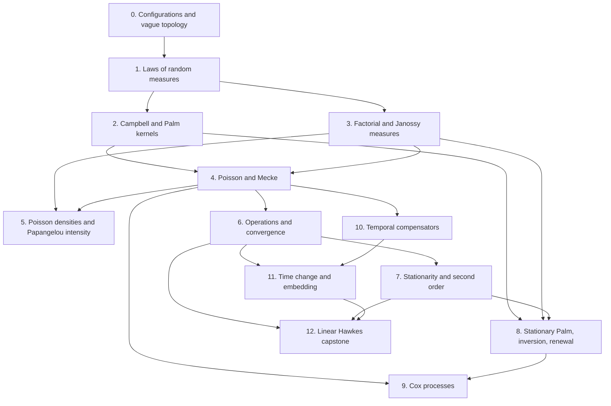

# Roadmap: random measures, point processes, Palm theory, and stochastic intensities

A random measure is a random element of the space of locally finite measures on a locally
compact Polish space, and a point process is the special case in which that measure is
integer-valued.  Building the general theory first makes the subject cohere: the law of a
random measure is determined by its Laplace functional, its intensity is an expectation, and
its Campbell measure disintegrates into Palm kernels.  All of this is defined before any assumptions about discreteness of measure.
Point processes inherit this and add what integer mass makes possible: count coordinates,
factorial and Janossy measures, reduced Palm kernels obtained by erasing one occurrence,
Poisson processes, and the two intensities that describe a point process locally, the
Papangelou intensity in space and the predictable stochastic intensity in time.  Cox
processes are where the two theories meet: conditionally Poisson given a random measure.

This roadmap builds that common trunk.  Its static summit is the chain of Poisson
characterizations

```text
independent Poisson counts
  ↔ exponential Laplace functional
  ↔ Mecke identity
  ↔ unchanged reduced Palm law,
```

together with Palm inversion for stationary processes.  Its dynamic summit is the clock
principle

```text
predictable compensator → unit-rate Poisson time change,
```

followed by the subcritical univariate linear Hawkes process as a deliberately small payoff:
the same process is constructed both by predictable Poisson embedding and as a stationary
Poisson cluster process.

Suggested homes:

```text
TauCeti/MeasureTheory/Measure/LocallyFinite.lean
TauCeti/Probability/RandomMeasure/Configuration.lean
TauCeti/Probability/RandomMeasure/Law.lean
TauCeti/Probability/RandomMeasure/Campbell.lean
TauCeti/Probability/PointProcess/Factorial.lean
TauCeti/Probability/PointProcess/Janossy.lean
TauCeti/Probability/PointProcess/Poisson.lean
TauCeti/Probability/PointProcess/FiniteDensity.lean
TauCeti/Probability/PointProcess/Operations.lean
TauCeti/Probability/PointProcess/Convergence.lean
TauCeti/Probability/RandomMeasure/Stationary.lean
TauCeti/Probability/PointProcess/Palm.lean
TauCeti/Probability/PointProcess/Renewal.lean
TauCeti/Probability/PointProcess/Cox.lean
TauCeti/Probability/PointProcess/Temporal/History.lean
TauCeti/Probability/PointProcess/Temporal/Compensator.lean
TauCeti/Probability/PointProcess/Temporal/Intensity.lean
TauCeti/Probability/PointProcess/Temporal/TimeChange.lean
TauCeti/Probability/PointProcess/Temporal/Embedding.lean
TauCeti/Probability/PointProcess/Hawkes/Linear.lean
```

## Scope and boundaries

This roadmap owns the reusable random-measure and point-process substrate and one capstone
model.  In scope are:

* locally finite random measures on a locally compact Polish space, with point measures as
  the closed subset of integer-valued ones;
* laws of random measures and their Laplace functionals; for point processes, count
  coordinates, probability-generating functionals, and avoidance functions;
* Campbell measures and Palm kernels of random measures; for point processes, ordinary and
  reduced Palm kernels;
* factorial measures, factorial moment measures, and local Janossy measures;
* Poisson random measures: construction, characterizations, operations, compound Poisson
  processes, and Poisson convergence;
* finite point processes with a density against a Poisson process: hereditary densities,
  the Papangelou intensity, and the Georgii–Nguyen–Zessin identity;
* translation stationarity on `EuclideanSpace ℝ (Fin d)`, ergodicity, mixing, and
  second-order measures;
* stationary Palm distributions, Palm averaging, mass transport, and Palm inversion, with
  stationary renewal processes as the worked example on the line;
* Cox processes, including stationary and Palm identities and a shot-noise example;
* marked temporal point measures, pathwise integrals of predictable integrands, predictable
  compensators, stochastic intensities, random time change, and Poisson embedding;
* the univariate nonnegative linear Hawkes process with integrable kernel of mass less than
  one: half-line construction, stationary cluster construction, uniqueness, mean intensity,
  convergence from the empty past, and its cluster-Palm decomposition.

Outside this roadmap are:

* Hawkes processes beyond the capstone: multivariate, marked, nonlinear, critical and
  supercritical models; stability rates, perfect simulation, likelihoods, inference,
  filtering, large deviations, and Hawkes-specific limit theory.  The small branching
  development in Layer 12 contains exactly the Poisson family tree required for linear
  Hawkes and is not a branching-process library.
* Determinantal and permanental point processes: locally trace-class kernels, Fredholm
  determinants, existence criteria, and correlation kernels.  These are spurs from the
  configuration, correlation, and Palm API built here, and need a functional-analysis
  substrate this roadmap does not build.
* Point-process spectra: Bartlett spectra, Fourier transforms of covariance measures, and
  frequency-domain estimation.  Layer 7 stops at the covariance measure and the covariogram
  formula, which is the exact handoff.
* Palm kernels of order two and higher, factorial Campbell measures, and iterated Palm laws.
  Every Palm statement here is first order.
* Change of measure for point processes: likelihood ratios, the stochastic exponential, and
  the point-process Girsanov theorem.
* Infinite-volume Gibbs processes; the renewal theorem and renewal-reward theory; the
  classification of infinitely divisible point processes (KLM theory) and Lévy–Khinchine;
  general branching processes; statistical estimation; and ergodic theorems for group
  actions, mean or pointwise, which belong to an ergodic-theory roadmap together with
  Følner sequences, amenable groups, and ergodic decomposition.  Stationarity, ergodicity,
  and mixing are defined here with Mathlib's vocabulary; no ergodic theorem is proved.

### Coordination with existing work

Two developments border this roadmap.  Their boundaries do not permit missing glue: a
target that uses one of them must still include any bridge its stated prerequisites do not
supply.

* **The Brownian-motion project** (Degenne, Ledvinka, Marion, Pfaffelhuber,
  [blueprint](https://remydegenne.github.io/brownian-motion/blueprint/)) owns general
  continuous-time stochastic calculus: right-continuous filtrations and the Debut theorem,
  the Doob–Meyer decomposition and its local versions, Doob's `Lᵖ` inequality, elementary
  and general stochastic integrals, Itô's formula, locally square-integrable martingales,
  semimartingales, and quasimartingales.  Its landed Mathlib material,
  `Filtration.predictable`, `IsStronglyPredictable`, `Filtration.IsRightContinuous`, and
  `Locally`, is the vocabulary of Layers 10–12.  This roadmap does not build any of the
  rest: every integral here is a pathwise Lebesgue–Stieltjes integral against a point
  measure and never an Itô integral; a compensator is *defined* by an integral identity and
  *constructed* explicitly for internal histories and their initial enlargements; and every
  theorem of Layers 11–12 takes the compensator as a hypothesis.  Existence of a compensator
  in an arbitrary filtration is the Doob–Meyer theorem for counting processes, which belongs
  to that project; no target here depends on it.
* **The [standard-distributions roadmap](../StandardDistributions/README.md)** owns the
  scalar laws: `poissonMeasure` with its moments, transforms, tail, and parameter
  measurability; `pgf`; `expMeasure` with memorylessness, minima, and Erlang sums; and the
  Gamma-mixed Poisson identity.  This roadmap states no scalar-law target and consumes those
  declarations wherever a count or an interarrival time is one-dimensional: the count of a
  Poisson process on one set has law `poissonMeasure`, the one-set specialization of the
  probability-generating functional is `pgf`, the real-line interarrival theorem of Layer 4
  consumes the exponential API, the law of small numbers in Layer 6 consumes Mathlib's
  binomial-to-Poisson limit, and the mixed-Poisson example of Layer 9 consumes the Gamma
  mixture identity.

The word **intensity** has four distinct meanings in this development and the API must not
identify them:

1. the intensity measure `𝔼 N` of a random measure;
2. its constant mean density under translation stationarity;
3. the Papangelou intensity `λ(x, ξ)` of a finite point process with a Poisson density, the
   conditional rate of an occurrence at `x` given the configuration elsewhere;
4. the predictable stochastic intensity `λ(ω,t,z)` of a temporal process, whose integral is
   its compensator.

## End goals

The completed trunk provides the following theorem packages.

1. **Configuration-space theorem.** `LocallyFiniteMeasure S`, with the vague topology, is
   Polish when `S` is locally compact Polish; `PointMeasure S` is a closed subset; the Borel
   σ-field of each is generated by evaluations on relatively compact Borel sets; and
   restrictions, translations, superpositions, and measurable enumeration of occurrences
   have usable APIs.
2. **Law-determination theorem.** The law of a random measure is determined by its Laplace
   functional on `C_c^+(S)`, equivalently by all finite-dimensional laws of evaluations on
   relatively compact Borel sets.  For a point process the count vectors and the
   probability-generating functional on functions equal to one off a compact set are
   further equivalent coordinates.
3. **Finite-window reconstruction theorem.** The sequence of Janossy measures on a
   relatively compact window reconstructs the law of the restricted process, with the
   normalization fixed below and with multiplicities handled correctly.
4. **Poisson–Mecke theorem.** Independent Poisson counts, the exponential formula, and the
   Mecke identity are equivalent; the multivariate Mecke identity, explicit Janossy
   measures, marking, thinning, mapping, superposition, and compound Poisson processes
   follow from this package.
5. **Georgii–Nguyen–Zessin theorem.** A finite point process with a hereditary density
   against a Poisson process on a window has a Papangelou intensity satisfying the GNZ
   identity, and the identity with a given Papangelou kernel determines the law.  The
   Poisson process is the case of constant Papangelou intensity.
6. **Poisson convergence theorem.** A Grigelionis-type triangular-array theorem turns rare,
   asymptotically negligible independent point processes into a Poisson limit.
7. **Palm theorem package.** Campbell disintegration gives Palm kernels of random measures;
   translation stationarity gives the refined Campbell theorem, typical-point averaging,
   Slivnyak's theorem, and inversion between a stationary law and its Palm law, with the
   stationary renewal process as the worked case on the line.
8. **Cox theorem package.** Conditional Poisson construction gives the Cox Laplace
   functional, factorial-moment and variance identities, identifiability of the director's
   law, inheritance of stationarity and mixing, and the size-biased directing law under Palm.
9. **Compensator theorem package.** A compensator is a predictable random measure
   satisfying the integral identity against nonnegative predictable integrands; it is unique
   up to evanescence; it exists for the internal history of every locally finite temporal
   point process and for initial enlargements of that history, by an explicit hazard
   formula; and pathwise integrals of bounded predictable integrands against the
   compensated measure are martingales, with the isometry when the compensator is
   continuous.
10. **Poisson-clock theorem package.** Watanabe's characterization and random time change
    identify a continuous, nonterminating compensated clock with a unit-rate Poisson process;
    Poisson embedding constructs processes from predictable intensities under explicit
    nonexplosion and uniqueness hypotheses.
11. **Linear Hawkes theorem.** For `ν > 0`, `h ≥ 0`, and `∫ h < 1`, Poisson embedding and the
    immigrant–offspring construction give the same process; there is a unique stationary
    finite-intensity law, with mean rate `ν / (1 - ∫ h)`, the empty-past process converges
    locally to it after translation to late times, and size-biasing one cluster gives its
    Palm law.

## Encoding conventions

These choices are part of the specification.  Implementations of different layers must
share them.

### State spaces and bounded windows

The configuration theory works on a locally compact Polish type `S`, expressed with
Mathlib's compatible metric, topology, and Borel instances:

```lean
[MetricSpace S] [PolishSpace S] [LocallyCompactSpace S]
[MeasurableSpace S] [BorelSpace S]
```

Thus Lean is given the compatible complete separable metric; the roadmap does not rely on
typeclass synthesis to choose one from abstract locally compact second-countable Hausdorff
hypotheses.  A **bounded window** means a relatively compact Borel set, expressed as
`MeasurableSet W` together with `IsCompact (closure W)`.  Theorems use measurable spaces and
`StandardBorelSpace` alone when topology and local finiteness do not enter.

Stationarity specializes to `S = EuclideanSpace ℝ (Fin d)`, with its `volume` and addition.
It does not pretend that an arbitrary `S` has translations.  Mark spaces in the marking and
temporal theories are standard Borel.  For such a mark space `E`, build
`MarkedLocallyFiniteMeasure S E`, the measures on `S × E` finite on `W × Set.univ` for every
relatively compact `W`, and its integer-valued subtype `MarkedPointMeasure S E`.  Both carry
the evaluation measurable space; when `E` is also locally compact Polish, relate them to the
vague topology on `LocallyFiniteMeasure (S × E)` and `PointMeasure (S × E)`.  Temporal point
measures are `MarkedPointMeasure ℝ≥0 E` with no occurrence at time zero, and compensators
are random elements of `MarkedLocallyFiniteMeasure ℝ≥0 E`.  This base-local convention
permits a non-topological standard-Borel mark space without losing finite ground counts.

### Measures first, multiplicities retained

Build a subtype `LocallyFiniteMeasure S` of `Measure S`, using Mathlib's
`IsFiniteMeasureOnCompacts`.  Define integer-valued measures by

```lean
def Measure.IsIntegerValued (μ : Measure S) : Prop :=
  ∀ ⦃A : Set S⦄, MeasurableSet A → μ A < ∞ → ∃ n : ℕ, μ A = n

def PointMeasure (S : Type*) ... :=
  {μ : Measure S // IsFiniteMeasureOnCompacts μ ∧ μ.IsIntegerValued}
```

The carrier is a measure subtype, not a sequence, multiset, or bundled process.  A point
measure may put mass `2`, `3`, and so on at one location.  Simplicity is the predicate

```text
ξ is simple  ↔  ξ {x} ≤ 1 for every x.
```

This convention is essential: a Cox process directed by an atomic random measure generally
has multiplicities.  `erase ξ x` subtracts one occurrence at `x`, not the whole atom.

`LocallyFiniteMeasure S` carries the vague topology generated by `μ ↦ ∫ x, f x ∂μ` for
nonnegative compactly supported continuous `f`, and `PointMeasure S` the subspace topology.
Their measurable spaces are the Borel σ-fields of those topologies.  Prove that these equal
the σ-fields generated by `μ ↦ μ A` for Borel `A`; do not install two competing
measurable-space instances.

### Random measures and point processes stay unbundled

A random measure on `(Ω,P)` is a measurable map `Λ : Ω → LocallyFiniteMeasure S`, and a
point process is a measurable map

```lean
N : Ω → PointMeasure S
```

with `P : Measure Ω`, under `[IsProbabilityMeasure P]`, carried separately.  Do not
introduce a structure bundling `Ω`, `P`, and `N`.  Predicates such as stationarity or the
Poisson property take `P` and `N` as explicit arguments.  The law is `P.map N`; the
intensity measure and Campbell measures are averages formed with `Measure.bind`.  Every
random-measure theorem applies to a point process through the coercion
`PointMeasure S → LocallyFiniteMeasure S`, and point-process theorems are stated for
`N : Ω → PointMeasure S` directly rather than for a random measure with an integrality
hypothesis.

Moment hypotheses are stated in Mathlib's vocabulary on the derived measures, never as new
predicates:

```text
IsFiniteMeasureOnCompacts (intensity P N)
IsFiniteMeasureOnCompacts (factorialMomentMeasure P N n)
```

The first says `𝔼[N K] < ∞` for every compact `K`; since `S` is σ-compact, Mathlib's
instance `SigmaFinite.of_isFiniteMeasureOnCompacts` then makes the intensity σ-finite, which
is what Palm disintegration needs.  Pathwise local finiteness alone does not imply either.
The second makes the `n`th factorial moment measure locally finite.

The elementary functionals are defined at Kallenberg's and Last–Penrose's generality.  For
any measurable space `X`, a **random measure on `X`** is a measurable `N : Ω → Measure X`
for the Giry σ-field, and `intensity`, `laplaceFunctional`, `campbellMeasure`,
`palmKernel`, and the Poisson property are defined for such `N`.  A **point process on
`X`** is a random measure whose values are σ-finite and integer-valued.  The carriers
`LocallyFiniteMeasure S`, `PointMeasure S`, and their marked versions enter through the
coercion to `Measure X` wherever a theorem needs local finiteness, the vague topology, or
law determination by `C_c^+(S)`.  Last–Penrose's s-finite generality is not adopted: every
intensity in this roadmap is σ-finite, and Mathlib's `SigmaFinite` instances then apply.
Insertion and erasure are Mathlib's measure addition and subtraction: `μ + Measure.dirac x`
and `μ - Measure.dirac x`, the latter leaving `μ` unchanged when `μ {x} = 0`.

### Functionals and finite-window coordinates

The Laplace functional of a random measure is defined directly for every nonnegative
measurable extended-real-valued `f` by

```text
L_Λ(f) = 𝔼 exp(-∫ f dΛ),        f ≥ 0,
```

with `exp(-∞)=0`.  Nonnegative compactly supported continuous functions form the
vague-convergence and law-determining test class; no claim is made that every nonnegative
Borel function is a monotone limit of functions in `C_c^+(S)`.  For a point process the
probability-generating functional is

```text
G_N(v) = 𝔼 ∏_{x∈N} v(x),        0 ≤ v ≤ 1,
```

where `1-v` has relatively compact support and occurrences, not distinct locations, are
multiplied.  Prove `G_N(v) = L_N(-log v)` with the zero convention handled explicitly, and
prove that on `v = 1 - (1-t)·1_A` it is `pgf (fun ω => N ω A) P t`, Tau Ceti's probability
generating function of the count.

For `n : ℕ`, `ξ.factorial n` is the measure on `Fin n → S` obtained by choosing ordered
distinct **occurrences** of `ξ`; locations in the tuple may coincide when `ξ` has
multiplicity.  Its expectation is the `n`th factorial moment measure.  Correlation functions
are Radon–Nikodym derivatives of factorial moment measures with respect to a named reference
measure; they are not primitive data.

For a relatively compact Borel window `W`, fix the Janossy normalization

```text
J[W,n](B) = (1 / n!) 𝔼[1{N(W)=n} · N|W ^(n)(B)].
```

Thus `J[W,n] univ = P(N(W)=n)`.  Pushing `J[W,n]` forward by
`(x₁,…,xₙ) ↦ δ_{x₁}+⋯+δ_{xₙ}` gives the part of the restricted law with exactly `n` points,
without another factorial.  Janossy measures are local objects.  No global Janossy density
is introduced.

Factorial moment measures do not determine a law without a stated moment-determinacy or
growth condition.  Weak convergence of laws does not imply convergence of intensity or
factorial moment measures without a stated uniform-integrability condition.

### Palm conventions

For a random measure `Λ` and a random element `Y : Ω → T`, define the Campbell measure by

```text
C[Λ,Y](A × B) = 𝔼 ∫ 1_A(x) 1_B(Y) Λ(dx).
```

Its first marginal is the intensity measure `𝔼 Λ`.  When the intensity is σ-finite and the
target is nonempty standard Borel, a Palm kernel `Pˣ` is the probability-kernel
disintegration

```text
C[Λ,Y](dx,dy) = (𝔼 Λ)(dx) Pˣ(dy),
```

defined intensity-almost everywhere and unique only there.  With `Y=Λ`, this is the
ordinary Palm kernel of the random measure.  For a point process `N` with `Y=N`, the reduced
Palm kernel is the pushforward of the ordinary one by `ξ ↦ erase ξ x`.  Public theorems
distinguish ordinary from reduced Palm laws in their names.

For a stationary process, use the centering translation

```text
(θₓ ξ)(B) = ξ(B + x),
```

so a selected point at `x` is moved to the origin.  A Palm **probability** at the origin is
normalized only under finite positive intensity density `0 < λ < ∞`.  Sigma-finite Palm
measures remain available without that normalization.

### Papangelou conventions

Fix a bounded window `W` and a locally finite diffuse reference measure `μ` on `S`, with
`Π[μ|W]` the law of the Poisson process with intensity `μ|W`.  A finite point process on `W`
**has a Poisson density** `f` when its law is `Π[μ|W].withDensity f` for measurable
`f : PointMeasure S → ℝ≥0∞`.  The density is **hereditary** when `f ξ > 0` implies
`f (erase ξ x) > 0` for every occurrence `x` of `ξ`.  The Papangelou intensity is

```text
λ(x, ξ) = f(ξ + δ_x) / f(ξ)   when f ξ > 0,   and 0 otherwise,
```

so `ξ` is the configuration *other than* the point at `x`, and the Georgii–Nguyen–Zessin
identity reads

```text
𝔼 ∫ h(x, erase N x) N(dx) = 𝔼 ∫ h(x, N) λ(x, N) μ(dx)
```

for nonnegative measurable `h`.  Papangelou intensities are defined only in this
finite-window setting; no infinite-volume Papangelou kernel is introduced.

### Temporal conventions

A marked temporal process is a `MarkedPointMeasure ℝ≥0 E`-valued random element with zero
mass at time `0` and finite on `(0,t] × Set.univ` for every `t < ∞`.  The unmarked process
uses `E = PUnit`.  The associated count is

```text
N_t = N ((0,t] × E),
```

and paths are right-continuous.  The internal history is generated by restrictions of `N`
to `(0,t] × E`, then completed and made right-continuous when a theorem assumes the usual
conditions.

For a filtration `𝓕`, the predictable σ-field on `ℝ≥0 × Ω` is Mathlib's
`Filtration.predictable`; a marked predictable integrand is measurable for its product with
the measurable space on `E`.  Every integral `∫ H dN` and `∫ H dA` is a pathwise
`lintegral` against the point measure or compensator at a fixed `ω`; no stochastic integral
in the Itô sense is defined.  A compensator is a predictable random element `A` of
`MarkedLocallyFiniteMeasure ℝ≥0 E` characterized by

```text
𝔼 ∫ H dN = 𝔼 ∫ H dA
```

for every nonnegative predictable `H`, where predictability of `A` means that
`(t, ω) ↦ A ω ((0,t] × B)` is `Filtration.predictable`-measurable for every measurable `B`.
Lebesgue measure on `ℝ≥0` is `nnvolume`, the comap of `volume` on `ℝ`, since Mathlib has no
`MeasureSpace ℝ≥0` instance.
A stochastic intensity is a predictable density `λ` in `A(dt,dz)=λ(t,z)dt Q(dz)` relative to
an explicitly named σ-finite reference measure `Q`.  A formula for `λ` is not, by itself, an
existence or uniqueness theorem for a process.

## What Mathlib and Tau Ceti already supply

Consume rather than duplicate:

* **Measure core.** `Measure`, `Measure.dirac`, restriction, mapping, products and countable
  sums come from `Mathlib/MeasureTheory/Measure/MeasureSpaceDef.lean`, `Dirac.lean`,
  `Restrict.lean`, `Map.lean`, `Prod.lean`, and `Count.lean`; `Measure.bind` and the
  evaluation measurable space on measures come from
  `Mathlib/MeasureTheory/Measure/GiryMonad.lean`.
* **Local finiteness and Radon integration.** `IsFiniteMeasureOnCompacts` and
  `IsLocallyFiniteMeasure` are in `Mathlib/MeasureTheory/Measure/Typeclasses/Finite.lean`,
  with `SigmaFinite.of_isFiniteMeasureOnCompacts` in `Typeclasses/SFinite.lean`; regularity
  and compactly supported integration are in `Mathlib/MeasureTheory/Measure/Regular.lean`,
  `Mathlib/MeasureTheory/Measure/RegularityCompacts.lean`, and
  `Mathlib/MeasureTheory/Integral/CompactlySupported.lean`.
* **Signed measures.** `SignedMeasure`, subtraction, total variation, and Jordan/Radon–Nikodym
  infrastructure come from `Mathlib/MeasureTheory/VectorMeasure/Basic.lean` and the
  `Mathlib/MeasureTheory/VectorMeasure/Decomposition/` subtree; covariance measures use this
  API rather than pretending that a signed object is a positive `Measure`.
* **Finite-measure weak topology.** `FiniteMeasure`, the Lévy–Prokhorov metric, and Prokhorov
  compactness are in `Mathlib/MeasureTheory/Measure/FiniteMeasure.lean`,
  `Mathlib/MeasureTheory/Measure/LevyProkhorovMetric.lean`, and
  `Mathlib/MeasureTheory/Measure/Prokhorov.lean`.  They do not provide the locally finite
  vague topology built in Layer 0.
* **Differentiation.** `Besicovitch.vitaliFamily` and `Besicovitch.ae_tendsto_rnDeriv`, for
  two locally finite measures, are in `Mathlib/MeasureTheory/Covering/Besicovitch.lean`; the
  `HasBesicovitchCovering` instance for finite-dimensional real normed spaces is in
  `BesicovitchVectorSpace.lean`.  Layer 2 specializes this API to Campbell measures instead
  of rebuilding differentiation theory.
* **Scalar Poisson and exponential laws.** From Mathlib, `poissonMeasure`,
  `poissonMeasure_conv_poissonMeasure`, and `charFun_map_cast_poissonMeasure` in
  `Mathlib/Probability/Distributions/Poisson/Basic.lean`, the binomial-to-Poisson limit
  `binomial_tendsto_poissonPMFReal_atTop` in `Poisson/PoissonLimitThm.lean`, and
  `expMeasure` with `cdf_expMeasure_eq` in `Exponential.lean`.  From Tau Ceti, the Poisson
  moments and transforms in `TauCeti/Probability/Distributions/Poisson/Basic.lean`, the
  tail `poissonMeasure_tail_eq_regularizedGamma` in `Poisson/Tail.lean`,
  `measurable_poissonMeasure` in `Distributions/Measurability.lean`, `pgf` with
  `pgf_poissonMeasure` and `measure_eq_of_pgf_eqOn` in
  `TauCeti/Probability/GeneratingFunction.lean`, `memoryless_expMeasure` and
  `hasLaw_min_expMeasure_of_indepFun` in `Distributions/Exponential.lean`,
  `iIndepFun.hasLaw_sum_expMeasure` in `Distributions/Sums.lean`, and
  `bind_gammaMeasure_poissonMeasure` in `Distributions/Gamma/Poisson.lean`.
* **Kernels and disintegration.** `Measure.condKernel` for a finite measure on a product
  with standard-Borel second factor, its `IsCondKernel` instance, and
  `Measure.disintegrate` are in `Mathlib/Probability/Kernel/Disintegration/StandardBorel.lean`
  and `Basic.lean`; a.e. uniqueness `eq_condKernel_of_measure_eq_compProd` is in
  `Unique.lean`.  These treat finite joint measures; Layer 2 builds the σ-finite adapter
  used by Palm theory.  Tau Ceti adds `countableCondKernel` for a countable first factor in
  `TauCeti/Probability/Kernel/Disintegration/Countable.lean`, and `measurable_infinitePi` in
  `TauCeti/MeasureTheory/Measure/ProductKernel.lean` is the measurability input for the
  Poisson construction from `Measure.infinitePi`.
* **Filtrations and martingales.** `Filtration`, `Filtration.natural`, and
  `Filtration.IsRightContinuous` are in `Mathlib/Probability/Process/Filtration.lean`;
  `IsStoppingTime`, `stoppedValue`, and `stoppedProcess` in `Stopping.lean`;
  `Filtration.predictable` and `IsStronglyPredictable` in `Predictable.lean`; `Locally` and
  `IsLocalizingSequence` in `LocalProperty.lean`; and `Martingale`, `Submartingale`, and
  `Supermartingale` in `Mathlib/Probability/Martingale/Basic.lean`.  These are the only
  stochastic-process notions Layers 10–12 use.
* **Tau Ceti measure adapters.** `Measure.map_bind` and `Measure.bind_map` in
  `TauCeti/MeasureTheory/Measure/GiryMonad.lean`; `measurable_sum_smul_dirac` and
  `measurable_probabilityMeasure_map` in `Measurability.lean`; the product-kernel
  measurability in `ProductKernel.lean`; the finite-measure extraction theorems in
  `Prokhorov.lean`; `IsCoupling` in `Coupling.lean`; and
  `Measure.ext_of_forall_integral_exp_neg_natCast_mul_eq` in
  `TauCeti/Probability/Moments/LaplaceDeterminacy.lean`, which is the uniqueness input for
  Cox identifiability in Layer 9.
* **Stationarity vocabulary.** `VAddInvariantMeasure` in `Mathlib/MeasureTheory/Group/Defs.lean`
  and `ErgodicVAdd` in `Mathlib/Dynamics/Ergodic/Action/Basic.lean` are the stationarity and
  ergodicity predicates of Layer 7; Haar-measure uniqueness in
  `Mathlib/MeasureTheory/Measure/Haar/Unique.lean` gives the intensity theorem.

This roadmap owns the configuration spaces of locally finite and point measures, their
vague topology, laws of random measures, σ-finite Campbell/Palm adapters, Poisson random
measures, Papangelou intensities, translation-stationary random measures, point-process
compensators, random time change, and the stated linear Hawkes theorem.

## Dependency graph



The layer numbers give a review order, not a claim that every edge is linear.  The
factorial/Janossy and Campbell/Palm tracks are independent after Layer 1; the Papangelou
layer is a leaf; and stationarity and the temporal track develop independently before
meeting in the Hawkes capstone.

## Layer 0: locally finite measures, point measures, and the vague topology

**From Mathlib.** Borel measures, `IsFiniteMeasureOnCompacts`, compactly supported
continuous functions `C_c(S, ℝ)`, measure restriction/map/sum, Polish-space topology, and
regularity.

**Build.**

* `LocallyFiniteMeasure S` and `PointMeasure S`, coercions to `Measure S`, extensionality,
  local finiteness and integer-valued accessors, and the `IsSimple` predicate.
* Point-measure constructors: zero, a Dirac occurrence, finite sums of Diracs, countable
  locally finite sums, addition/superposition, restriction, insertion `ξ + δₓ`, and
  one-occurrence erasure `ξ - δₓ` through Mathlib's `Measure.sub`.  Countable superposition carries the explicit hypothesis that only finitely many
  input occurrences meet each compact set.
* Mapping by a measurable `f : S → T` under the exact condition `μ (f ⁻¹' K) < ∞` for every
  compact `K`; proper maps are the principal reusable sufficient condition.  Injectivity
  controls simplicity but does not, by itself, preserve local finiteness.
* Count evaluation `ξ.count A` with codomain `ℕ∞`, equal to `ξ A` as an extended real, and
  finite on bounded windows; multiplicity `ξ {x}`, support, atoms, total mass, finiteness,
  and restriction to a bounded window.  Connect the integer-valued definition to atomic
  decomposition.
* A measurable enumeration of occurrences on a σ-compact space, using `Option S` so finite
  configurations terminate and repeated locations record multiplicity.  Prove
  reconstruction as a countable sum of Dirac measures and independence of results from the
  chosen enumeration.
* `MarkedLocallyFiniteMeasure S E` and `MarkedPointMeasure S E` for standard-Borel marks,
  their ground projections, restriction, insertion/erasure, and evaluation measurable
  space.  Prove the equivalence of `MarkedPointMeasure S E` with marked occurrence
  sequences and, when `E` is locally compact Polish, its compatibility with
  `PointMeasure (S × E)`.
* The vague topology on `LocallyFiniteMeasure S` generated by integration against
  `C_c(S, ℝ)`, with the portmanteau inequalities for compact and relatively compact open
  sets, and the subspace topology on `PointMeasure S`.
* Equality between the vague Borel σ-field and the evaluation σ-field; measurability of all
  constructors and coordinate operations above.
* Polishness and standard-Borelness of `LocallyFiniteMeasure S`, and closedness of the
  point measures inside it.

**Key declarations.**

```lean
/-- A measure is integer-valued when every measurable set of finite mass has natural-number
mass.  Sets of infinite mass are unconstrained. -/
def _root_.MeasureTheory.Measure.IsIntegerValued {X : Type*} [MeasurableSpace X] (μ : Measure X) :
    Prop :=
  ∀ ⦃A : Set X⦄, MeasurableSet A → μ A < ∞ → ∃ n : ℕ, μ A = n

/-- Locally finite measures on a topological measurable space. -/
def LocallyFiniteMeasure (S : Type*) [TopologicalSpace S] [MeasurableSpace S] :=
  {μ : Measure S // IsFiniteMeasureOnCompacts μ}

/-- Point measures: locally finite integer-valued measures.  Multiplicities are allowed. -/
def PointMeasure (S : Type*) [TopologicalSpace S] [MeasurableSpace S] :=
  {μ : Measure S // IsFiniteMeasureOnCompacts μ ∧ μ.IsIntegerValued}

/-- Marked locally finite measures: measures on `S × E` finite on `K × univ` for compact `K`. -/
def MarkedLocallyFiniteMeasure (S E : Type*) [TopologicalSpace S] [MeasurableSpace S]
    [MeasurableSpace E] :=
  {μ : Measure (S × E) // ∀ K : Set S, IsCompact K → μ (K ×ˢ Set.univ) < ∞}

/-- Marked point measures: integer-valued marked locally finite measures. -/
def MarkedPointMeasure (S E : Type*) [TopologicalSpace S] [MeasurableSpace S]
    [MeasurableSpace E] :=
  {μ : Measure (S × E) // (∀ K : Set S, IsCompact K → μ (K ×ˢ Set.univ) < ∞) ∧ μ.IsIntegerValued}

variable {S : Type*} [MetricSpace S] [PolishSpace S] [LocallyCompactSpace S] [MeasurableSpace S]
  [BorelSpace S]

/-- A point measure is in particular locally finite. -/
def PointMeasure.toLocallyFinite (ξ : PointMeasure S) : LocallyFiniteMeasure S := ⟨ξ.1, ξ.2.1⟩

/-- The vague topology: the coarsest making `μ ↦ ∫ x, f x ∂μ` continuous for every
`f : C_c(S, ℝ)`. -/
instance : TopologicalSpace (LocallyFiniteMeasure S) :=
  ⨅ f : C_c(S, ℝ), TopologicalSpace.induced (fun μ : LocallyFiniteMeasure S => ∫ x, f x ∂(μ : Measure S))
    inferInstance

instance : MeasurableSpace (LocallyFiniteMeasure S) := borel _
instance : BorelSpace (LocallyFiniteMeasure S) := ⟨rfl⟩
instance : PolishSpace (LocallyFiniteMeasure S)

/-- Point measures carry the subspace topology of the vague topology. -/
instance : TopologicalSpace (PointMeasure S) :=
  TopologicalSpace.induced PointMeasure.toLocallyFinite inferInstance

theorem LocallyFiniteMeasure.measurableSpace_eq_generateFrom_eval :
    (inferInstance : MeasurableSpace (LocallyFiniteMeasure S)) =
      MeasurableSpace.generateFrom
        {s | ∃ A, MeasurableSet A ∧ ∃ B, MeasurableSet B ∧
          s = {μ : LocallyFiniteMeasure S | (μ : Measure S) A ∈ B}}

theorem isClosed_range_pointMeasure_coe :
    IsClosed (Set.range (PointMeasure.toLocallyFinite : PointMeasure S → LocallyFiniteMeasure S))

/-- The count of a point measure on a set, as an extended natural number. -/
def PointMeasure.count (ξ : PointMeasure S) (A : Set S) : ℕ∞ :=
  if (ξ : Measure S) A = ∞ then ⊤ else (⌊((ξ : Measure S) A).toNNReal⌋₊ : ℕ∞)

def PointMeasure.IsSimple (ξ : PointMeasure S) : Prop := ∀ x, (ξ : Measure S) {x} ≤ 1

def PointMeasure.zero : PointMeasure S := ⟨0, inferInstance, fun _ _ _ => ⟨0, by simp⟩⟩

def PointMeasure.dirac (x : S) : PointMeasure S := ⟨Measure.dirac x, inferInstance, _⟩

/-- Insertion of one occurrence at `x`. -/
def PointMeasure.insert (ξ : PointMeasure S) (x : S) : PointMeasure S :=
  ⟨(ξ : Measure S) + Measure.dirac x, _, _⟩

/-- Erasure of one occurrence at `x`, through Mathlib's measure subtraction; `ξ` is unchanged when
`ξ {x} = 0`. -/
def PointMeasure.erase (ξ : PointMeasure S) (x : S) : PointMeasure S :=
  ⟨(ξ : Measure S) - Measure.dirac x, _, _⟩

def PointMeasure.restrict (ξ : PointMeasure S) (W : Set S) : PointMeasure S :=
  ⟨(ξ : Measure S).restrict W, _, _⟩

/-- A finite sum of Dirac occurrences. -/
def PointMeasure.ofTuple {n : ℕ} (x : Fin n → S) : PointMeasure S :=
  ⟨∑ i, Measure.dirac (x i), _, _⟩

/-- A finite superposition of point measures. -/
def PointMeasure.finsum {ι : Type*} [Fintype ι] (ξ : ι → PointMeasure S) : PointMeasure S :=
  ⟨∑ i, (ξ i : Measure S), _, _⟩

/-- A measurable enumeration of occurrences, with `none` after the last occurrence of a finite
configuration, and repeated locations recording multiplicity. -/
def PointMeasure.enum (ξ : PointMeasure S) : ℕ → Option S

theorem PointMeasure.coe_eq_sum_dirac_enum (ξ : PointMeasure S) :
    (ξ : Measure S) = Measure.sum fun n => (ξ.enum n).elim 0 Measure.dirac

theorem measurable_pointMeasure_count {A : Set S} (hA : MeasurableSet A) :
    Measurable fun ξ : PointMeasure S => ξ.count A
```

**Pinnacle.** The configuration-space theorem: vague convergence is characterized by
compactly supported continuous test integrals, and the resulting Polish Borel structure is
exactly the structure needed for evaluations and measurable enumeration.

**Completion checks.** The API computes restrictions and multiplicities of finite Dirac
sums; permits a vague limit in which two locations merge into a double point; and proves
that an atomic measure of noninteger mass is a locally finite measure but not a point
measure.

## Layer 1: laws of random measures and determining functionals

**From Layer 0.** Standard-Borel configuration spaces with measurable evaluations and
restrictions.  **From Mathlib/Tau Ceti.** Probability measures, maps, binds, monotone-class
arguments, measurable integration against measure-valued maps, and `pgf`.

**Build.**

* The helper `ENNReal.expNeg : ℝ≥0∞ → ℝ≥0`, equal to `exp (-t)` for finite `t` and `0` at
  `∞`, with continuity, antitonicity, and multiplicativity.
* For a random measure `Λ`, the law `P.map Λ`, the intensity measure
  `intensity P Λ = P.bind (fun ω => (Λ ω : Measure S))`, and restriction laws.  Prove the
  evaluation and integration formulas by Tonelli, and the equivalence of
  `IsFiniteMeasureOnCompacts (intensity P Λ)` with `𝔼[Λ K] < ∞` on a countable compact
  exhaustion.
* For a point process `N`, count vectors on finite families of Borel sets, their joint
  laws, void probabilities, and finite-dimensional consistency under refinement of
  partitions.
* Integration of a measurable test function against a random measure, jointly measurable in
  the configuration and any test-function parameters used by later layers.
* The Laplace functional of a random measure on nonnegative measurable `f`, and the
  probability-generating functional of a point process with the zero convention made
  explicit in the definition; monotonicity, continuity from below/above, restriction,
  superposition, the bridge `G_N(v) = L_N(-log v)`, and the bridge to `pgf` on
  `v = 1 - (1-t)·1_A`.
* Determining classes based on a countable ring of bounded windows and on `C_c^+(S)`.  Prove
  equality in law of random measures from finite-dimensional evaluation laws and from
  Laplace functionals, and of point processes from count vectors and generating functionals.
  Avoidance probabilities determine the law only in the simple case; record the required
  simplicity hypothesis on every avoidance-based uniqueness theorem.
* Random-measure versions of monotone convergence, dominated convergence, Fubini, and
  Campbell's elementary expectation identity `𝔼 ∫ f dΛ = ∫ f d(𝔼 Λ)`, stated so later
  proofs do not repeatedly unfold `Measure.bind`.

**Key declarations.**

```lean
/-- `expNeg t = exp (-t)`, with `expNeg ∞ = 0`. -/
def _root_.ENNReal.expNeg (t : ℝ≥0∞) : ℝ≥0 :=
  if t = ∞ then 0 else ⟨Real.exp (-t.toReal), (Real.exp_pos _).le⟩

variable {Ω : Type*} [mΩ : MeasurableSpace Ω] (P : Measure Ω) [IsProbabilityMeasure P]
variable {X : Type*} [MeasurableSpace X]
variable {S : Type*} [MetricSpace S] [PolishSpace S] [LocallyCompactSpace S] [MeasurableSpace S]
  [BorelSpace S]

/-- The intensity measure of a random measure, as a mixture. -/
def intensity (N : Ω → Measure X) : Measure X :=
  P.bind N

theorem intensity_apply {N : Ω → Measure X} (hN : Measurable N) {A : Set X}
    (hA : MeasurableSet A) :
    intensity P N A = ∫⁻ ω, N ω A ∂P

theorem lintegral_intensity {N : Ω → Measure X} (hN : Measurable N) {f : X → ℝ≥0∞}
    (hf : Measurable f) :
    ∫⁻ x, f x ∂intensity P N = ∫⁻ ω, ∫⁻ x, f x ∂N ω ∂P

theorem isFiniteMeasureOnCompacts_intensity_iff {Λ : Ω → LocallyFiniteMeasure S}
    (hΛ : Measurable Λ) :
    IsFiniteMeasureOnCompacts (intensity P fun ω => (Λ ω : Measure S)) ↔
      ∀ K : Set S, IsCompact K → ∫⁻ ω, (Λ ω : Measure S) K ∂P < ∞

/-- The Laplace functional `𝔼 exp (-∫ f dN)` of a random measure. -/
def laplaceFunctional (N : Ω → Measure X) (f : X → ℝ≥0∞) : ℝ≥0∞ :=
  ∫⁻ ω, ENNReal.expNeg (∫⁻ x, f x ∂N ω) ∂P

/-- The probability-generating functional `𝔼 ∏_{x ∈ N} v x`, with the factor `0` whenever
`v x = 0` at an occurrence. -/
def pgfl (N : Ω → PointMeasure S) (v : S → ℝ≥0) : ℝ≥0∞ :=
  laplaceFunctional P (fun ω => (N ω : Measure S))
    fun x => if v x = 0 then ∞ else ENNReal.ofReal (-Real.log (v x))

/-- The law of a random element as a probability measure, for the weak topology of Layer 6. -/
def law {α : Type*} [MeasurableSpace α] (Y : Ω → α) (hY : Measurable Y) : ProbabilityMeasure α :=
  ⟨P.map Y, (Measure.isProbabilityMeasure_map_iff hY.aemeasurable).2 inferInstance⟩

theorem map_eq_of_laplaceFunctional_eq {Λ Λ' : Ω → LocallyFiniteMeasure S}
    (hΛ : Measurable Λ) (hΛ' : Measurable Λ')
    (h : ∀ f : C_c(S, ℝ≥0),
      laplaceFunctional P (fun ω => (Λ ω : Measure S)) (fun x => (f x : ℝ≥0∞)) =
        laplaceFunctional P (fun ω => (Λ' ω : Measure S)) (fun x => (f x : ℝ≥0∞))) :
    P.map Λ = P.map Λ'

theorem map_eq_of_forall_count_eq {N N' : Ω → PointMeasure S}
    (hN : Measurable N) (hN' : Measurable N')
    (h : ∀ (n : ℕ) (A : Fin n → Set S), (∀ i, MeasurableSet (A i) ∧ IsCompact (closure (A i))) →
      P.map (fun ω i => (N ω).count (A i)) = P.map (fun ω i => (N' ω).count (A i))) :
    P.map N = P.map N'
```

**Pinnacle.** Law determination of a random measure by its Laplace functional on `C_c^+(S)`,
with the count-vector and generating-functional formulations for point processes.

**Completion checks.** The law of a deterministic configuration, a one-point process, and a
finite random configuration can be recovered in all three coordinate systems; the Laplace
functional of a deterministic measure `μ` is `expNeg (∫ f dμ)`; and every theorem states
whether it identifies the random variable almost surely or only its law.

## Layer 2: Campbell measures and Palm kernels

**From Layers 0–1.** Standard-Borel configuration spaces, measurable integration, and
locally finite intensity.  **From Mathlib.** Finite-measure standard-Borel disintegration
(`Measure.condKernel`, `Measure.disintegrate`), a.e. uniqueness, and `withDensity_compProd`.

**Build.**

* Campbell measures `campbellMeasure P N Y` on `X × T` for a random measure `N` and a jointly
  observed random element `Y`, their marginals, and the Campbell integration formula for
  nonnegative and integrable functions.
* A σ-finite disintegration adapter: for a measure `ρ` on `α × Ω'` with σ-finite first
  marginal and standard-Borel nonempty `Ω'`, choose a positive measurable `g` on `α` with
  `∫⁻ g ∂ρ.fst < ∞`, disintegrate the finite measure `ρ.withDensity (g ∘ Prod.fst)` with
  `Measure.condKernel`, and prove by `withDensity_compProd` that the same Markov kernel
  disintegrates `ρ`.  Prove a.e. uniqueness, independent of the chosen `g`.
* Under `SigmaFinite (intensity P N)`, which `IsFiniteMeasureOnCompacts` supplies on the
  σ-compact carriers, use that adapter against the intensity to obtain `palmKernel P N Y`; prove intensity-a.e. uniqueness, measurability in the
  location, and behavior under a change of version.
* For a point process `N`, the ordinary Palm kernel (`Y = N`) and the reduced Palm kernel
  obtained by one-occurrence erasure `μ ↦ μ - Measure.dirac x`.  Prove that an ordinary Palm configuration has an
  occurrence at its conditioning location almost surely and that insert/erase carry
  ordinary and reduced versions into one another.
* Palm kernels under restriction and proper injective mapping, with all null-set
  qualifications explicit.  Marking and superposition formulas live in Layer 6 after those
  operations exist.
* On a metric space with Mathlib's `HasBesicovitchCovering`, identify Palm expectations as
  limits of normalized **Campbell-size-biased** averages over closed balls.  For bounded
  nonnegative measurable `g`, apply `Besicovitch.ae_tendsto_rnDeriv` to

  ```text
  ρ_g(A) = 𝔼∫_A g(x,Y) Λ(dx),
  ρ_g(B(x,r)) / (𝔼Λ)(B(x,r)) → ∫ g(x,y) Pˣ(dy)
  ```

  at intensity-almost every center.  This is a Radon–Nikodym differentiation statement, not
  unqualified conditioning on the event `N(B(x,r)) > 0`.

**Key declarations.**

```lean
variable {Ω : Type*} [mΩ : MeasurableSpace Ω] (P : Measure Ω) [IsProbabilityMeasure P]
variable {X : Type*} [MeasurableSpace X] {T : Type*} [MeasurableSpace T]
variable {S : Type*} [MetricSpace S] [PolishSpace S] [LocallyCompactSpace S] [MeasurableSpace S]
  [BorelSpace S]

/-- The Campbell measure of a random measure and a jointly observed random element. -/
def campbellMeasure (N : Ω → Measure X) (Y : Ω → T) : Measure (X × T) :=
  P.bind fun ω => (N ω).map fun x => (x, Y ω)

theorem campbellMeasure_fst {N : Ω → Measure X} {Y : Ω → T} (hN : Measurable N)
    (hY : Measurable Y) :
    (campbellMeasure P N Y).fst = intensity P N

theorem lintegral_campbellMeasure {N : Ω → Measure X} {Y : Ω → T} (hN : Measurable N)
    (hY : Measurable Y) {g : X × T → ℝ≥0∞} (hg : Measurable g) :
    ∫⁻ p, g p ∂campbellMeasure P N Y = ∫⁻ ω, ∫⁻ x, g (x, Y ω) ∂N ω ∂P

/-- Disintegration of a measure on a product with σ-finite first marginal and standard Borel second
factor, obtained from `Measure.condKernel` after reweighting by a positive integrable function of
the first coordinate. -/
def _root_.MeasureTheory.Measure.sigmaFiniteCondKernel {α Ω' : Type*} [MeasurableSpace α]
    [MeasurableSpace Ω'] [StandardBorelSpace Ω'] [Nonempty Ω'] (ρ : Measure (α × Ω'))
    [SigmaFinite ρ.fst] : Kernel α Ω'

instance {α Ω' : Type*} [MeasurableSpace α] [MeasurableSpace Ω'] [StandardBorelSpace Ω']
    [Nonempty Ω'] (ρ : Measure (α × Ω')) [SigmaFinite ρ.fst] :
    IsMarkovKernel ρ.sigmaFiniteCondKernel

theorem _root_.MeasureTheory.Measure.compProd_fst_sigmaFiniteCondKernel {α Ω' : Type*}
    [MeasurableSpace α] [MeasurableSpace Ω'] [StandardBorelSpace Ω'] [Nonempty Ω']
    (ρ : Measure (α × Ω')) [SigmaFinite ρ.fst] :
    ρ.fst ⊗ₘ ρ.sigmaFiniteCondKernel = ρ

theorem _root_.MeasureTheory.Measure.eq_sigmaFiniteCondKernel_of_measure_eq_compProd {α Ω' : Type*}
    [MeasurableSpace α] [MeasurableSpace Ω'] [StandardBorelSpace Ω'] [Nonempty Ω']
    (ρ : Measure (α × Ω')) [SigmaFinite ρ.fst] (κ : Kernel α Ω') [IsMarkovKernel κ]
    (h : ρ.fst ⊗ₘ κ = ρ) :
    ∀ᵐ x ∂ρ.fst, κ x = ρ.sigmaFiniteCondKernel x

/-- The Palm kernel of a random measure `N` with respect to a jointly observed `Y`. -/
def palmKernel (N : Ω → Measure X) (Y : Ω → T) [StandardBorelSpace T] [Nonempty T]
    [SigmaFinite (intensity P N)] : Kernel X T :=
  (campbellMeasure P N Y).sigmaFiniteCondKernel

theorem compProd_intensity_palmKernel {N : Ω → Measure X} {Y : Ω → T} [StandardBorelSpace T]
    [Nonempty T] [SigmaFinite (intensity P N)] (hN : Measurable N) (hY : Measurable Y) :
    intensity P N ⊗ₘ palmKernel P N Y = campbellMeasure P N Y

/-- The reduced Palm kernel of a point process on `S`: the ordinary Palm kernel pushed forward by
erasing one occurrence at the conditioning location. -/
def reducedPalmKernel (N : Ω → PointMeasure S)
    [SigmaFinite (intensity P fun ω => (N ω : Measure S))] : Kernel S (PointMeasure S)

theorem reducedPalmKernel_apply {N : Ω → PointMeasure S}
    [SigmaFinite (intensity P fun ω => (N ω : Measure S))] (x : S) :
    reducedPalmKernel P N x =
      (palmKernel P (fun ω => (N ω : Measure S)) N x).map fun ξ => ξ.erase x

theorem palmKernel_ae_pos_singleton {N : Ω → PointMeasure S} (hN : Measurable N)
    [SigmaFinite (intensity P fun ω => (N ω : Measure S))] :
    ∀ᵐ x ∂intensity P (fun ω => (N ω : Measure S)),
      palmKernel P (fun ω => (N ω : Measure S)) N x {ξ | 0 < (ξ : Measure S) {x}} = 1
```

**Pinnacle.** The Campbell disintegration theorem for a random measure and an arbitrary
jointly observed random element `Y`, with ordinary and reduced point-process Palm kernels as
reusable specializations.

**Completion checks.** The kernel is normalized against its intensity, not Lebesgue measure;
changing it on an intensity-null set leaves every theorem invariant; and erasure removes one
copy from a multiple point.

## Layer 3: factorial measures, moment measures, and Janossy reconstruction

**From Layers 0–1.** Measurable enumeration, finite-window restriction, product measures,
and law functionals.

**Build.**

* Factorial powers `ξ.factorial n` on `Fin n → S`, defined intrinsically by recursive
  deletion and iterated integration, including order zero, insert/erase formulas, symmetry,
  product-set evaluation, restriction, mapping, and superposition identities.  Definitions
  count distinct occurrences rather than distinct spatial locations; Layer 0's enumeration
  is a proof device, not the definition.
* Factorial moment measures `factorialMomentMeasure P N n`, local finiteness under
  `IsFiniteMeasureOnCompacts (factorialMomentMeasure P N n)`, and mixed factorial moments of
  disjoint counts.  Under `∃ c > 2, 𝔼[c ^ N(W)] < ∞`, prove the finite-window factorial
  expansion of the probability-generating functional with absolute convergence.
* Correlation measures and correlation functions relative to a named reference measure,
  including symmetry and the relation between the first two correlation functions and
  intensity/covariance.
* Janossy measures `janossyMeasure P N W n` for every `n`, including `n=0`, with the fixed
  `1/n!` normalization; symmetry, total mass, and their generating-functional expansion.
  Pin restriction consistency as follows.  For `V ⊆ W`, `U = W \ V`, and measurable
  `A ⊆ V^n`, prove

  ```text
  J[V,n](A) = ∑ k, choose (n+k) n · J[W,n+k](A × U^k).
  ```

* Reconstruction of the finite-window law by pushing each Janossy measure through the sum
  of Diracs.  Prove the converse construction from symmetric finite measures on `W^n`,
  including the order-zero measure, whose total masses sum to one.  A system over windows
  must satisfy the displayed restriction identities.
* The local identities

  ```text
  α[n](A) = ∑ k, (n+k)!/k! · J[W,n+k](A × W^k),
  J[W,n](A) = (1/n!) ∑ k, (-1)^k/k! · α[n+k](A × W^k).
  ```

  The first holds unconditionally as a sum of nonnegative terms.  For the second, assume
  the pinned local exponential-moment condition `∃ c > 2, 𝔼[c ^ N(W)] < ∞` for the window
  `W`; prove absolute convergence and every interchange of sum and integral from it.  Prove
  local moment determinacy under the same condition and never state it unconditionally.

**Key declarations.**

```lean
variable {Ω : Type*} [mΩ : MeasurableSpace Ω] (P : Measure Ω) [IsProbabilityMeasure P]
variable {S : Type*} [MetricSpace S] [PolishSpace S] [LocallyCompactSpace S] [MeasurableSpace S]
  [BorelSpace S]

/-- The `n`th factorial power: ordered `n`-tuples of distinct occurrences. -/
def PointMeasure.factorial (ξ : PointMeasure S) (n : ℕ) : Measure (Fin n → S)

theorem PointMeasure.factorial_zero (ξ : PointMeasure S) :
    ξ.factorial 0 = Measure.dirac finZeroElim

theorem PointMeasure.factorial_univ_pi (ξ : PointMeasure S) {A : Set S} (hA : MeasurableSet A)
    (hA' : (ξ : Measure S) A < ∞) (n : ℕ) :
    ξ.factorial n (Set.univ.pi fun _ => A) = ((ξ.count A).toNat.descFactorial n : ℝ≥0∞)

def factorialMomentMeasure (N : Ω → PointMeasure S) (n : ℕ) : Measure (Fin n → S) :=
  P.bind fun ω => (N ω).factorial n

/-- The `n`th Janossy measure on the window `W`, with the `1/n!` normalization. -/
def janossyMeasure (N : Ω → PointMeasure S) (W : Set S) (n : ℕ) : Measure (Fin n → S) :=
  (n.factorial : ℝ≥0∞)⁻¹ •
    (P.restrict {ω | (N ω).count W = n}).bind fun ω => ((N ω).restrict W).factorial n

theorem janossyMeasure_univ {N : Ω → PointMeasure S} (hN : Measurable N) {W : Set S}
    (hW : MeasurableSet W) (n : ℕ) :
    janossyMeasure P N W n Set.univ = P {ω | (N ω).count W = n}

theorem map_restrict_eq_sum_map_janossyMeasure {N : Ω → PointMeasure S} (hN : Measurable N)
    {W : Set S} (hW : MeasurableSet W) (hWc : IsCompact (closure W)) :
    P.map (fun ω => (N ω).restrict W) =
      Measure.sum fun n => (janossyMeasure P N W n).map PointMeasure.ofTuple

theorem janossyMeasure_restrict_eq_tsum {N : Ω → PointMeasure S} (hN : Measurable N)
    {V W : Set S} (hV : MeasurableSet V) (hVW : V ⊆ W) (hW : MeasurableSet W)
    (hWc : IsCompact (closure W)) {n : ℕ} {A : Set (Fin n → S)} (hA : MeasurableSet A)
    (hAV : A ⊆ Set.univ.pi fun _ => V) :
    janossyMeasure P N V n A =
      ∑' k, ((n + k).choose n : ℝ≥0∞) *
        janossyMeasure P N W (n + k)
          {x | (fun i => x (Fin.castAdd k i)) ∈ A ∧ ∀ j, x (Fin.natAdd n j) ∈ W \ V}
```

**Pinnacle.** Janossy reconstruction of every relatively compact restriction, including
nonsimple configurations, and the theorem that compatible finite-window Janossy systems
determine the global point-process law.

**Completion checks.** On a window containing a deterministic double point, `factorial 2`
has mass two at the repeated location, while the normalized second Janossy measure has total
mass one.  This test guards the distinction between occurrences and locations.

## Layer 4: Poisson random measures and Mecke calculus

**From Layers 0–3.** Configuration laws, functionals, Campbell/Palm kernels, factorial and
Janossy measures.  **From Mathlib/Tau Ceti.** `poissonMeasure` with its convolution,
`measurable_poissonMeasure`, `expMeasure` with memorylessness, minima, and Erlang sums,
`Measure.infinitePi`, and `measurable_infinitePi`.

**Build.**

* `IsPoissonRandomMeasure P N Λ` for a random measure on any measurable space `X` and a
  σ-finite `Λ`, defined by independent counts with law `poissonMeasure` on every finite
  family of pairwise disjoint measurable sets of finite `Λ`-measure, and the abbreviation
  `IsPoissonPointProcess` for point processes on `S`.  Permit every σ-finite `Λ`;
  simplicity is a theorem exactly when `Λ` has no atoms.
* Construction of `poissonLaw Λ : Measure (Measure X)` for σ-finite `Λ` on any measurable
  space, following Last–Penrose Theorem 3.6: on each piece of a finite partition of `Λ`,
  a `poissonMeasure` number of i.i.d. locations with the normalized law, realized as the
  pushforward of `Measure.infinitePi`; then the countable superposition.  Prove that the
  law is independent of the partition, that it is carried by σ-finite integer-valued
  measures, and that every Poisson random measure with intensity `Λ` has this law.  On a
  locally compact Polish `S`, package the measurable kernel `poissonPointKernel` from
  `LocallyFiniteMeasure S` to `PointMeasure S`, whose measurability is seeded by
  `measurable_poissonMeasure`.
* Equivalence with the exponential Laplace formula

  ```text
  L_N(f) = exp(-∫ (1-exp(-f)) dΛ),
  ```

  and its one-set specialization to `pgf_poissonMeasure`.
* The Poisson specialization of Layer 2's Campbell formula, the Mecke identity on
  `Measure X` with insertion `N + Measure.dirac x`, the multivariate Mecke identity, and the
  converse Mecke characterization for point processes on `X`.  Derive the factorial moment
  measures `Λ^n` and the exponential formula.
* Rényi's avoidance characterization: for a simple process with atomless locally finite
  intensity `Λ`, the Poisson avoidance formula on a determining family of bounded windows
  characterizes the Poisson law.
* Explicit local Janossy measures

  ```text
  J[W,n] = exp(-Λ W) / n! · (Λ|W)^n.
  ```

* Ordinary and reduced Palm formulas: the ordinary Palm law inserts one occurrence at the
  conditioning location, and the reduced Palm law equals the original Poisson law
  (Slivnyak–Mecke).
* On `ℝ≥0`, for a simple nonexplosive process and a homogeneous rate `γ > 0`, equivalence
  among homogeneous Poisson random measure, stationary independent increments of the count
  process, and i.i.d. interarrival times with law `expMeasure γ`; the `n`th event time then
  has the Erlang law by `iIndepFun.hasLaw_sum_expMeasure`.  Prove deterministic
  cumulative-rate transformation for an atomless inhomogeneous intensity; state separately
  how atoms produce multiple points.

**Key declarations.**

```lean
/-- Lebesgue measure on `ℝ≥0`, as the comap of Lebesgue measure on `ℝ`. -/
def nnvolume : Measure ℝ≥0 := Measure.comap ((↑) : ℝ≥0 → ℝ) volume

variable {Ω : Type*} [mΩ : MeasurableSpace Ω] (P : Measure Ω) [IsProbabilityMeasure P]
variable {X : Type*} [MeasurableSpace X]
variable {S : Type*} [MetricSpace S] [PolishSpace S] [LocallyCompactSpace S] [MeasurableSpace S]
  [BorelSpace S]

/-- The Poisson property of a random measure on an arbitrary measurable space: independent counts
with law `poissonMeasure` on disjoint sets of finite `Λ`-measure. -/
def IsPoissonRandomMeasure (N : Ω → Measure X) (Λ : Measure X) : Prop :=
  Measurable N ∧
    ∀ (n : ℕ) (A : Fin n → Set X), (∀ i, MeasurableSet (A i) ∧ Λ (A i) < ∞) →
      Pairwise (Disjoint on A) →
        iIndepFun (fun i ω => N ω (A i)) P ∧
          ∀ i, HasLaw (fun ω => N ω (A i))
            ((poissonMeasure (Λ (A i)).toNNReal).map (Nat.cast : ℕ → ℝ≥0∞)) P

/-- The Poisson property of a point process on `S`. -/
abbrev IsPoissonPointProcess (N : Ω → PointMeasure S) (Λ : Measure S) : Prop :=
  IsPoissonRandomMeasure P (fun ω => (N ω : Measure S)) Λ

/-- The law of the Poisson random measure with σ-finite intensity `Λ`, as a pushforward of
`Measure.infinitePi`. -/
def poissonLaw (Λ : Measure X) [SigmaFinite Λ] : Measure (Measure X)

theorem isPoissonRandomMeasure_id_poissonLaw (Λ : Measure X) [SigmaFinite Λ] :
    IsPoissonRandomMeasure (poissonLaw Λ) id Λ

theorem map_eq_poissonLaw {N : Ω → Measure X} {Λ : Measure X} [SigmaFinite Λ]
    (h : IsPoissonRandomMeasure P N Λ) :
    P.map N = poissonLaw Λ

/-- The Poisson kernel on a locally compact Polish space, measurable in the intensity. -/
def poissonPointKernel : Kernel (LocallyFiniteMeasure S) (PointMeasure S)

theorem map_coe_poissonPointKernel (Λ : LocallyFiniteMeasure S) :
    (poissonPointKernel Λ).map (fun ξ : PointMeasure S => (ξ : Measure S)) = poissonLaw (Λ : Measure S)

theorem laplaceFunctional_of_isPoissonRandomMeasure {N : Ω → Measure X} {Λ : Measure X}
    [SigmaFinite Λ] (h : IsPoissonRandomMeasure P N Λ) {f : X → ℝ≥0∞} (hf : Measurable f) :
    laplaceFunctional P N f =
      (ENNReal.expNeg (∫⁻ x, (1 - (ENNReal.expNeg (f x) : ℝ≥0∞)) ∂Λ) : ℝ≥0∞)

theorem mecke_of_isPoissonRandomMeasure {N : Ω → Measure X} {Λ : Measure X} [SigmaFinite Λ]
    (h : IsPoissonRandomMeasure P N Λ) {g : X × Measure X → ℝ≥0∞} (hg : Measurable g) :
    ∫⁻ ω, ∫⁻ x, g (x, N ω) ∂N ω ∂P = ∫⁻ x, ∫⁻ ω, g (x, N ω + Measure.dirac x) ∂P ∂Λ

theorem isPoissonRandomMeasure_iff_mecke {N : Ω → Measure X} {Λ : Measure X} [SigmaFinite Λ]
    (hN : Measurable N) (hN' : ∀ ω, SigmaFinite (N ω) ∧ (N ω).IsIntegerValued) :
    IsPoissonRandomMeasure P N Λ ↔
      ∀ g : X × Measure X → ℝ≥0∞, Measurable g →
        ∫⁻ ω, ∫⁻ x, g (x, N ω) ∂N ω ∂P = ∫⁻ x, ∫⁻ ω, g (x, N ω + Measure.dirac x) ∂P ∂Λ

theorem reducedPalmKernel_of_isPoissonPointProcess {N : Ω → PointMeasure S} {Λ : Measure S}
    [IsFiniteMeasureOnCompacts Λ] [SigmaFinite (intensity P fun ω => (N ω : Measure S))]
    (h : IsPoissonPointProcess P N Λ) :
    ∀ᵐ x ∂Λ, reducedPalmKernel P N x = P.map N

theorem ae_isSimple_of_isPoissonPointProcess {N : Ω → PointMeasure S} {Λ : Measure S}
    [IsFiniteMeasureOnCompacts Λ] [NullSingletonClass Λ] (h : IsPoissonPointProcess P N Λ) :
    ∀ᵐ ω ∂P, (N ω).IsSimple

theorem janossyMeasure_of_isPoissonPointProcess {N : Ω → PointMeasure S} {Λ : Measure S}
    [IsFiniteMeasureOnCompacts Λ] (h : IsPoissonPointProcess P N Λ) {W : Set S}
    (hW : MeasurableSet W) (hWc : IsCompact (closure W)) (n : ℕ) :
    janossyMeasure P N W n =
      ((ENNReal.expNeg (Λ W) : ℝ≥0∞) / n.factorial) • Measure.pi fun _ : Fin n => Λ.restrict W

/-- The `k`th smallest occurrence of a point measure on the half line, or `∞`. -/
def nthPoint (ξ : PointMeasure ℝ≥0) (k : ℕ) : ℝ≥0∞

theorem iIndepFun_interarrival_of_isPoissonPointProcess {N : Ω → PointMeasure ℝ≥0} {γ : ℝ}
    (hγ : 0 < γ) (h : IsPoissonPointProcess P N (ENNReal.ofReal γ • nnvolume)) :
    iIndepFun (fun k ω => (nthPoint (N ω) (k + 1)).toReal - (nthPoint (N ω) k).toReal) P ∧
      ∀ k, HasLaw (fun ω => (nthPoint (N ω) (k + 1)).toReal - (nthPoint (N ω) k).toReal)
        (expMeasure γ) P
```

**Pinnacle.** Mecke's characterization: a point process with σ-finite intensity `Λ`
is Poisson with intensity `Λ` if and only if it satisfies the Mecke identity for every
nonnegative measurable test function.

**Completion checks.** The construction covers atomic `Λ` and produces multiplicities; the
atomless case proves simplicity; finite-window Janossy masses sum to one; the count on one
window has law `poissonMeasure` and its `pgf` is `pgf_poissonMeasure`; and the real-line
construction's interarrival times satisfy `memoryless_expMeasure`.

## Layer 5: finite point processes with a Poisson density and the Papangelou intensity

**From Layers 3–4.** Janossy measures and the Poisson law on a bounded window.

Fix a bounded window `W` and a locally finite atomless reference measure `μ` on `S`.  The
Poisson process with intensity `μ|W` is the reference law on finite configurations in `W`.

**Build.**

* `HasPoissonDensity P N μ W f`: the law of `N` is `poissonPointLaw (μ|W)`, the Poisson law
  on `PointMeasure S`, with density `f`.
  Prove that such an `N` is almost surely finite, simple, and supported in `W`, and that
  its Janossy measures are `exp(-μ W)/n!` times `f` evaluated on the sum of Diracs, against
  `(μ|W)^n`.  Conversely, a finite process whose Janossy measures are absolutely continuous
  with respect to `(μ|W)^n` for every `n` has a Poisson density.
* Hereditary densities, and positivity of `f` at the empty configuration under
  heredity.
* The Papangelou intensity `papangelouIntensity f x ξ = f (ξ + δₓ) / f ξ` with the zero
  convention, its measurability, and its symmetry under exchanging two inserted points.
* The Georgii–Nguyen–Zessin identity for every nonnegative measurable `h`, and its converse:
  a process with hereditary Poisson density whose Papangelou intensity is `μ|W`-a.e. equal
  to a given kernel `λ` is determined in law by `λ`, since `f` is recovered from `λ` by
  iterated insertion from the empty configuration and normalized.
* The Poisson case: the Poisson process with intensity `c · μ|W` has density
  `c^{N(W)} exp((1-c) μ W)` and constant Papangelou intensity `c`.  The hard-core case: the
  density proportional to the indicator that no two occurrences lie within distance `r`
  is hereditary, and its Papangelou intensity is the indicator that `x` is at distance
  at least `r` from every occurrence of `ξ`, times the normalizing constant.
* The one-window Mecke identity as the GNZ identity with constant Papangelou intensity,
  reconciling this layer with Layer 4.

**Key declarations.**

```lean
variable {Ω : Type*} [mΩ : MeasurableSpace Ω] (P : Measure Ω) [IsProbabilityMeasure P]
variable {S : Type*} [MetricSpace S] [PolishSpace S] [LocallyCompactSpace S] [MeasurableSpace S]
  [BorelSpace S]

/-- The Poisson law on `PointMeasure S` with a locally finite intensity. -/
def poissonPointLaw (μ : Measure S) [IsFiniteMeasureOnCompacts μ] : Measure (PointMeasure S) :=
  poissonPointKernel ⟨μ, inferInstance⟩

/-- The law of `N` is the Poisson law with intensity `μ|W`, with density `f`. -/
def HasPoissonDensity (N : Ω → PointMeasure S) (μ : Measure S) [IsFiniteMeasureOnCompacts μ]
    (W : Set S) (f : PointMeasure S → ℝ≥0∞) : Prop :=
  Measurable N ∧ Measurable f ∧ P.map N = (poissonPointLaw (μ.restrict W)).withDensity f

def IsHereditary (f : PointMeasure S → ℝ≥0∞) : Prop :=
  ∀ (ξ : PointMeasure S) (x : S), 0 < (ξ : Measure S) {x} → 0 < f ξ → 0 < f (ξ.erase x)

/-- The Papangelou intensity `f (ξ + δₓ) / f ξ`, read as zero where `f ξ = 0`. -/
def papangelouIntensity (f : PointMeasure S → ℝ≥0∞) (x : S) (ξ : PointMeasure S) : ℝ≥0∞ :=
  if f ξ = 0 then 0 else f (ξ.insert x) / f ξ

theorem janossyMeasure_of_hasPoissonDensity {N : Ω → PointMeasure S} {μ : Measure S}
    [IsFiniteMeasureOnCompacts μ] [NullSingletonClass μ] {W : Set S} {f : PointMeasure S → ℝ≥0∞}
    (hN : HasPoissonDensity P N μ W f) (hW : MeasurableSet W) (hWc : IsCompact (closure W))
    (n : ℕ) :
    janossyMeasure P N W n =
      ((ENNReal.expNeg (μ W) : ℝ≥0∞) / n.factorial) •
        (Measure.pi fun _ : Fin n => μ.restrict W).withDensity
          fun x => f (PointMeasure.ofTuple x)

theorem gnz_of_hasPoissonDensity {N : Ω → PointMeasure S} {μ : Measure S}
    [IsFiniteMeasureOnCompacts μ] [NullSingletonClass μ] {W : Set S} {f : PointMeasure S → ℝ≥0∞}
    (hN : HasPoissonDensity P N μ W f) (hf : IsHereditary f)
    {h : S × PointMeasure S → ℝ≥0∞} (hh : Measurable h) :
    ∫⁻ ω, ∫⁻ x, h (x, (N ω).erase x) ∂(N ω : Measure S) ∂P =
      ∫⁻ x, ∫⁻ ω, h (x, N ω) * papangelouIntensity f x (N ω) ∂P ∂(μ.restrict W)

theorem map_eq_of_papangelouIntensity_ae_eq {N N' : Ω → PointMeasure S} {μ : Measure S}
    [IsFiniteMeasureOnCompacts μ] [NullSingletonClass μ] {W : Set S} {f f' : PointMeasure S → ℝ≥0∞}
    (hN : HasPoissonDensity P N μ W f) (hf : IsHereditary f)
    (hN' : HasPoissonDensity P N' μ W f') (hf' : IsHereditary f')
    (h : ∀ᵐ x ∂μ.restrict W, ∀ ξ, papangelouIntensity f x ξ = papangelouIntensity f' x ξ) :
    P.map N = P.map N'

theorem papangelouIntensity_of_isPoissonPointProcess {N : Ω → PointMeasure S} {μ : Measure S}
    [IsFiniteMeasureOnCompacts μ] [NullSingletonClass μ] {W : Set S} (hW : MeasurableSet W)
    (hWc : IsCompact (closure W)) {c : ℝ≥0} (hc : 0 < c)
    (h : IsPoissonPointProcess P N ((c : ℝ≥0∞) • μ.restrict W)) :
    HasPoissonDensity P N μ W (fun ξ =>
      (c : ℝ≥0∞) ^ (ξ.count W).toNat * ENNReal.ofReal (Real.exp ((1 - (c : ℝ)) * (μ W).toReal))) ∧
    ∀ x ξ, papangelouIntensity
      (fun ξ => (c : ℝ≥0∞) ^ (ξ.count W).toNat *
        ENNReal.ofReal (Real.exp ((1 - (c : ℝ)) * (μ W).toReal))) x ξ = c
```

**Pinnacle.** The GNZ identity and its converse: for hereditary Poisson densities, the
Papangelou intensity determines the law, and the Poisson process is the case of constant
Papangelou intensity.

**Completion checks.** The hard-core density is hereditary and its Papangelou intensity
vanishes inside the exclusion balls; a non-hereditary density (positive only on
configurations with exactly two points) has a Papangelou intensity that is zero on the
empty configuration, and the converse theorem does not apply to it; and the constant-`c`
case recovers Layer 4's Mecke identity on `W`.

## Layer 6: operations, coupling, and convergence

**From Layers 0–4.** Measurable configuration operations, the Poisson law on a measurable
space, and Laplace/Mecke calculus.  **From Mathlib.** `Measure.join`, `Measure.compProd`,
`charFun`, the weak topology on `ProbabilityMeasure` of a Polish space, and Prokhorov's
theorem.

**Build, operations.**

* Restriction and measurable mapping of a random measure, and Poisson preservation under
  both: restriction to any measurable set, and mapping by `f` whenever `Λ.map f` is
  σ-finite.
* Independent marking on a standard Borel `X` by a Markov kernel `K : Kernel X E`: the
  kernel `markKernel K` attaching independent marks to the occurrences of a σ-finite
  integer-valued measure, and the predicate `IsIndependentMarking P N K M` saying that the
  joint law of `(N, M)` is `P.map N ⊗ₘ markKernel K`.  Prove the marking theorem: the
  marking of a Poisson random measure with intensity `Λ` is Poisson with intensity
  `Λ ⊗ₘ K`.  Derive displacement (mark then project) and its intensity `Λ.bind K`.
* Independent thinning as marking with Bernoulli marks followed by restriction, color
  splitting as marking with a finite mark space, and their Poisson theorems, including
  independence of the color classes and not only their marginal laws.
* Finite and countable independent superposition, Poisson when the summed intensity is
  σ-finite.
* Compound Poisson processes: for a Poisson random measure on `ℝ≥0 × ℝ` with intensity
  `γ · volume ⊗ Q`, the marked sum over `(0, t]` has stationary independent increments,
  characteristic function `exp (γ t ∫ (e^{iuz} - 1) Q(dz))`, and mean and variance
  `γ t ∫ z dQ` and `γ t ∫ z² dQ` under the corresponding moment hypotheses.
* Intensity formulas for every operation; factorial-moment formulas for restriction,
  mapping, marking, thinning, and independent superposition; and Palm formulas: pushforward
  under injective mapping, the original marking kernel at the selected point under
  marking, the original Palm configuration with all unselected occurrences independently
  thinned under thinning, and under superposition the mixture of "component `i`
  Palm-conditioned, all other components unconditioned" with weights `dΛᵢ/d(∑j Λⱼ)`.
* Coupling by acceptance regions: for a Poisson random measure on `X × ℝ≥0` with intensity
  `Λ ⊗ volume` and a measurable `A ⊆ X × ℝ≥0`, the projection of the restriction to `A` is
  Poisson with intensity `Λ.withDensity (fun x => volume (Prod.mk x ⁻¹' A))`.  Deduce the
  monotone coupling of Poisson processes with ordered intensity densities.  This is the
  static precursor of Poisson embedding.
* Finite Poisson cluster processes on a standard Borel `X`: for a cluster kernel
  `K : Kernel X (Measure X)` carried by finite integer-valued measures, the cluster process
  is the marking by `K` followed by `Measure.join` of the mark projection.  Prove the
  Laplace functional `exp (-∫ (1 - L_{K x}(f)) dΛ)`, the intensity `Λ.bind (join ∘ K)`, the
  local-finiteness criterion `∫ K x {ζ | ζ B > 0} Λ(dx) < ∞` for bounded `B`, and the
  cluster-Palm formula: the reduced Palm law at `x` is the law of the process superposed
  with an independent cluster drawn from the Campbell disintegration of
  `∫ Λ(dy) ∫ K y (dζ) ζ(dx) δ_{ζ - δₓ}` at `x`.  General infinite divisibility is not part
  of this construction.

**Build, convergence.**

* Weak convergence of laws on `LocallyFiniteMeasure S` and `PointMeasure S`, through
  Mathlib's `ProbabilityMeasure` topology on these Polish spaces, so that Prokhorov's
  theorem applies.  Prove the tightness criterion: a family is tight if and only if the
  counts on each bounded window are tight.
* Equivalence between weak convergence and convergence of Laplace functionals on `C_c^+(S)`
  bounded by one, and with convergence in law of `∫ f dξₙ` for each such `f`.
* For a simple limit, the avoidance criterion: `ξₙ → ξ` weakly if and only if
  `P(ξₙ U = 0) → P(ξ U = 0)` for bounded windows `U` in a dissecting ring of continuity
  sets and `limsup P(ξₙ I > 1) ≤ P(ξ I > 1)` on a dissecting semiring.
* Continuous mapping for restriction to a bounded window whose boundary is null for the
  limit's intensity; separate theorems for convergence of intensities under uniform
  integrability of `ξₙ K` and of `r`th factorial moment measures under uniform integrability
  of the falling factorial.
* Grigelionis' theorem for a null array of independent point processes: with
  `max_j P(ξ_{nj} B > 0) → 0` for bounded `B`, the row sums converge weakly to the Poisson
  process with intensity `Λ` if and only if `∑_j P(ξ_{nj} I = 1) → Λ I` on a dissecting
  semiring of `Λ`-continuity sets and `∑_j P(ξ_{nj} B > 1) → 0` for bounded `B`.  State the
  Laplace-functional form as well.
* Corollaries: the binomial process of `n` i.i.d. points with law `Qₙ` converges to the
  Poisson process with intensity `Λ` when `n Qₙ → Λ` vaguely with `Λ` atomless, and the
  one-window count statement is Mathlib's `binomial_tendsto_poissonPMFReal_atTop`.

**Key declarations.**

```lean
variable {Ω : Type*} [mΩ : MeasurableSpace Ω] (P : Measure Ω) [IsProbabilityMeasure P]
variable {X : Type*} [MeasurableSpace X] {E : Type*} [MeasurableSpace E] {Y : Type*} [MeasurableSpace Y]
variable {S : Type*} [MetricSpace S] [PolishSpace S] [LocallyCompactSpace S] [MeasurableSpace S]
  [BorelSpace S]

/-- The kernel attaching independent marks with law `K x` to the occurrences of a σ-finite
integer-valued measure on a standard Borel space. -/
def markKernel [StandardBorelSpace X] (K : Kernel X E) [IsMarkovKernel K] :
    Kernel (Measure X) (Measure (X × E))

def IsIndependentMarking [StandardBorelSpace X] (N : Ω → Measure X) (K : Kernel X E)
    [IsMarkovKernel K] (M : Ω → Measure (X × E)) : Prop :=
  Measurable M ∧ (∀ᵐ ω ∂P, (M ω).map Prod.fst = N ω) ∧
    P.map (fun ω => (N ω, M ω)) = P.map N ⊗ₘ markKernel K

theorem isPoissonRandomMeasure_of_isIndependentMarking [StandardBorelSpace X]
    {N : Ω → Measure X} {Λ : Measure X} [SigmaFinite Λ] {K : Kernel X E} [IsMarkovKernel K]
    {M : Ω → Measure (X × E)} (hN : IsPoissonRandomMeasure P N Λ)
    (hM : IsIndependentMarking P N K M) :
    IsPoissonRandomMeasure P M (Λ ⊗ₘ K)

theorem isPoissonRandomMeasure_map {N : Ω → Measure X} {Λ : Measure X}
    (hN : IsPoissonRandomMeasure P N Λ) {f : X → Y} (hf : Measurable f)
    [SigmaFinite (Λ.map f)] :
    IsPoissonRandomMeasure P (fun ω => (N ω).map f) (Λ.map f)

theorem isPoissonRandomMeasure_sum {N : ℕ → Ω → Measure X} {Λ : ℕ → Measure X}
    (hind : iIndepFun N P) (h : ∀ i, IsPoissonRandomMeasure P (N i) (Λ i))
    [SigmaFinite (Measure.sum Λ)] :
    IsPoissonRandomMeasure P (fun ω => Measure.sum fun i => N i ω) (Measure.sum Λ)

/-- The compound Poisson process: the sum of the real marks over `(0, t]`. -/
def compoundPoisson (M : Ω → Measure (ℝ≥0 × ℝ)) (t : ℝ≥0) (ω : Ω) : ℝ :=
  ∫ p, p.2 ∂((M ω).restrict (Set.Ioc 0 t ×ˢ Set.univ))

theorem charFun_compoundPoisson {M : Ω → Measure (ℝ≥0 × ℝ)} {γ : ℝ} (hγ : 0 < γ)
    {Q : Measure ℝ} [IsProbabilityMeasure Q]
    (hM : IsPoissonRandomMeasure P M ((ENNReal.ofReal γ • nnvolume).prod Q)) (t : ℝ≥0) (u : ℝ) :
    charFun (P.map (compoundPoisson M t)) u =
      Complex.exp (((γ * (t : ℝ) : ℝ) : ℂ) *
        ∫ z : ℝ, (Complex.exp ((u : ℂ) * (z : ℂ) * Complex.I) - 1) ∂Q)

/-- A Poisson cluster process: independent clusters attached to the points of a Poisson parent
process and superposed. -/
def IsPoissonCluster [StandardBorelSpace X] (Λ : Measure X) [SigmaFinite Λ]
    (K : Kernel X (Measure X)) [IsMarkovKernel K] (N : Ω → Measure X) : Prop :=
  Measurable N ∧
    P.map N = (poissonLaw Λ).bind fun ξ =>
      (markKernel K ξ).map fun M => Measure.join (M.map Prod.snd)

theorem laplaceFunctional_of_isPoissonCluster [StandardBorelSpace X] {Λ : Measure X}
    [SigmaFinite Λ] {K : Kernel X (Measure X)} [IsMarkovKernel K] {N : Ω → Measure X}
    (h : IsPoissonCluster P Λ K N) {f : X → ℝ≥0∞} (hf : Measurable f) :
    laplaceFunctional P N f =
      (ENNReal.expNeg (∫⁻ x, (1 - ∫⁻ ζ, (ENNReal.expNeg (∫⁻ y, f y ∂ζ) : ℝ≥0∞) ∂K x) ∂Λ) :
        ℝ≥0∞)

theorem tendsto_law_iff_laplaceFunctional {Λₙ : ℕ → Ω → LocallyFiniteMeasure S}
    {Λ : Ω → LocallyFiniteMeasure S} (hₙ : ∀ n, Measurable (Λₙ n)) (h : Measurable Λ) :
    Tendsto (fun n => law P (Λₙ n) (hₙ n)) atTop (𝓝 (law P Λ h)) ↔
      ∀ f : C_c(S, ℝ≥0), (∀ x, f x ≤ 1) →
        Tendsto (fun n => laplaceFunctional P (fun ω => (Λₙ n ω : Measure S)) fun x => (f x : ℝ≥0∞))
          atTop (𝓝 (laplaceFunctional P (fun ω => (Λ ω : Measure S)) fun x => (f x : ℝ≥0∞)))

/-- Grigelionis' theorem for a null array of independent point processes. -/
theorem tendsto_sum_poissonLaw_of_nullArray {m : ℕ → ℕ}
    {ξ : (n : ℕ) → Fin (m n) → Ω → PointMeasure S}
    (hmeas : ∀ n j, Measurable (ξ n j)) (hind : ∀ n, iIndepFun (ξ n) P)
    (hnull : ∀ B, MeasurableSet B → IsCompact (closure B) →
      Tendsto (fun n => ⨆ j, P {ω | 0 < (ξ n j ω).count B}) atTop (𝓝 0))
    {Λ : LocallyFiniteMeasure S}
    (h1 : ∀ I, MeasurableSet I → IsCompact (closure I) → (Λ : Measure S) (frontier I) = 0 →
      Tendsto (fun n => ∑ j, P {ω | (ξ n j ω).count I = 1}) atTop (𝓝 ((Λ : Measure S) I)))
    (h2 : ∀ B, MeasurableSet B → IsCompact (closure B) →
      Tendsto (fun n => ∑ j, P {ω | 1 < (ξ n j ω).count B}) atTop (𝓝 0)) :
    Tendsto (fun n => law P (fun ω => PointMeasure.finsum fun j => ξ n j ω) _) atTop
      (𝓝 (⟨poissonPointKernel Λ, inferInstance⟩ : ProbabilityMeasure (PointMeasure S)))
```

**Pinnacle.** The Grigelionis Poisson convergence theorem, stated in both count-set and
Laplace-functional forms.

**Completion checks.** A sequence may converge vaguely while points escape to infinity; a
sequence may converge weakly without its mean counts converging; the marking of a Poisson
process by a constant kernel is the product Poisson process; and the compound Poisson
process with `Q = δ₁` is the Poisson count process.

## Layer 7: stationarity, mixing, and second-order structure

**From Layers 0–6.** Translation maps, intensity and factorial moment measures, weak
convergence, and superposition.  **From Mathlib.** `VAddInvariantMeasure`, `ErgodicVAdd`,
and Haar-measure uniqueness.

Write `E d` for `EuclideanSpace ℝ (Fin d)`; the line is `ℝ` itself.

**Build.**

* For a locally compact Polish additive group `G`, the translation action
  `x +ᵥ μ = μ.map (· - x)` on `LocallyFiniteMeasure G` and `PointMeasure G`, so that
  `(x +ᵥ μ) B = μ (B + x)`; continuity, measurability, and the action laws.
  Stationarity of a random measure is `VAddInvariantMeasure G _ (P.map Λ)`; prove its
  equivalence with `P.map (fun ω => x +ᵥ Λ ω) = P.map Λ` for every `x`.
* On `E d`, under `𝔼 Λ([0,1)^d) < ∞`, the intensity measure is `λ • volume` with
  `λ = intensityDensity P Λ`, by uniqueness of translation-invariant measures.  Prove that a
  stationary point process is almost surely empty or infinite.
* Ergodicity as `ErgodicVAdd`, and mixing as `P(Λ ∈ A, x +ᵥ Λ ∈ B) → P(Λ ∈ A) P(Λ ∈ B)`
  as `‖x‖ → ∞`, reduced to a generating π-system; mixing implies ergodicity.  Prove that
  a stationary Poisson process with finite intensity is mixing, that measurable
  equivariant factors inherit stationarity, ergodicity, and mixing, and that independent
  superposition preserves each.
* The second factorial moment measure `α₂` and its reduced version `α₂^!` on `E d`,
  defined by `α₂^!(B) = 𝔼 ∫∫ 1_{[0,1)^d}(x) 1_B(y - x) N^{(2)}(d(x,y))`, with the
  disintegration `α₂(A × B) = ∫_A α₂^!(B - x) dx`; local square integrability if and only
  if `α₂^!` is locally finite; the pair correlation function as the density of `α₂^!`
  against `λ² volume` when it exists.  Define the covariance and reduced covariance as
  locally finite `SignedMeasure`s with their Jordan bounds on bounded windows.
* For a bounded Borel window `W`, the covariogram formula

  ```text
  Var N(W) = λ |W| + ∫ |W ∩ (W - x)| γ_red(dx),
  ```

  where `γ_red = α₂^! - λ²·volume`.  This is the exact handoff to a spectral roadmap; no
  Fourier transform is built here.
* The local approximation: for a simple stationary process and a bounded `B` of positive
  volume, `P(N(rB) ≥ 1) / volume(rB) → λ` and `P(N(rB) = 1) / volume(rB) → λ` as `r → 0`.

**Key declarations.**

```lean
/-- Euclidean space, the carrier of the stationarity theory. -/
abbrev E (d : ℕ) := EuclideanSpace ℝ (Fin d)

/-- The unit cube `[0,1)^d`. -/
def unitCube (d : ℕ) : Set (E d) := {x | ∀ i, x i ∈ Set.Ico (0 : ℝ) 1}

variable {Ω : Type*} [mΩ : MeasurableSpace Ω] (P : Measure Ω) [IsProbabilityMeasure P]
variable {G : Type*} [MetricSpace G] [PolishSpace G] [LocallyCompactSpace G] [MeasurableSpace G]
  [BorelSpace G] [AddGroup G] [IsTopologicalAddGroup G]

/-- Translation: `(x +ᵥ μ) B = μ (B + x)`, moving a point at `x` to the origin. -/
instance : VAdd G (LocallyFiniteMeasure G) where
  vadd x μ := ⟨(μ : Measure G).map (· - x), _⟩

instance : VAdd G (PointMeasure G) where
  vadd x ξ := ⟨(ξ : Measure G).map (· - x), _, _⟩

theorem coe_vadd_apply (x : G) (μ : LocallyFiniteMeasure G) {B : Set G} (hB : MeasurableSet B) :
    ((x +ᵥ μ : LocallyFiniteMeasure G) : Measure G) B = (μ : Measure G) ((· + x) '' B)

/-- The intensity density: the mean mass of a chosen unit set, `unitCube d` on `E d` and
`Set.Ico 0 1` on the line. -/
def intensityDensity (Λ : Ω → LocallyFiniteMeasure G) (U : Set G) : ℝ≥0∞ :=
  intensity P (fun ω => (Λ ω : Measure G)) U

theorem intensity_eq_smul_volume {d : ℕ} {Λ : Ω → LocallyFiniteMeasure (E d)} (hΛ : Measurable Λ)
    [VAddInvariantMeasure (E d) (LocallyFiniteMeasure (E d)) (P.map Λ)]
    (hfin : intensityDensity P Λ (unitCube d) < ∞) :
    intensity P (fun ω => (Λ ω : Measure (E d))) = intensityDensity P Λ (unitCube d) • volume

/-- The reduced second factorial moment measure of a stationary point process. -/
def reducedSecondFactorialMomentMeasure (P : Measure Ω) {d : ℕ} (N : Ω → PointMeasure (E d)) :
    Measure (E d)

theorem variance_count_eq_covariogram {d : ℕ} {N : Ω → PointMeasure (E d)} (hN : Measurable N)
    [VAddInvariantMeasure (E d) (PointMeasure (E d)) (P.map N)]
    [IsFiniteMeasureOnCompacts (reducedSecondFactorialMomentMeasure P N)]
    {W : Set (E d)} (hW : MeasurableSet W) (hWc : IsCompact (closure W)) :
    variance (fun ω => (((N ω).count W).toNat : ℝ)) P =
      (intensityDensity P (fun ω => (N ω : LocallyFiniteMeasure (E d))) (unitCube d)).toReal *
          (volume W).toReal +
        (∫⁻ x, volume (W ∩ ((· - x) '' W)) ∂reducedSecondFactorialMomentMeasure P N).toReal -
        ((intensityDensity P (fun ω => (N ω : LocallyFiniteMeasure (E d))) (unitCube d)).toReal *
          (volume W).toReal) ^ 2
```

**Pinnacle.** The second-order theorem: the reduced second factorial moment measure
disintegrates the second factorial moment measure, and the covariogram formula.

**Completion checks.** State every second-order result with local second-moment hypotheses; keep stationarity of a law
distinct from stationarity of one chosen realization; and check that a stationary Poisson
process has `α₂^! = λ² volume` and covariogram integral zero.

## Layer 8: stationary Palm distributions, inversion, and stationary renewal processes

**From Layers 2–7.** Palm kernels, Poisson and operation formulas, translation
stationarity, and factorial measures.  **From Mathlib/Tau Ceti.**
`Measure.infinitePi` over `ℤ`, and `expMeasure` with its memorylessness.

Throughout, `N` is a stationary point process on `E d` with `0 < λ < ∞`.

**Build.**

* The stationary Palm probability `palmProbability P N`, defined from the unit cube by
  `P⁰(A) = λ⁻¹ 𝔼 ∫_{[0,1)^d} 1_A(x +ᵥ N) N(dx)`; prove that it is a probability measure,
  that any bounded window of positive volume gives the same measure, and the refined
  Campbell formula

  ```text
  𝔼 ∫ f(x, θₓN) N(dx) = λ ∫ dx 𝔼⁰ f(x, N⁰).
  ```

  Relate it to Layer 2: for `volume`-a.e. `x`, the Palm kernel at `x` is `P⁰` translated
  back by `x`.
* The ordinary Palm law has an occurrence at the origin almost surely; the reduced law is
  its image under erasing that occurrence; the insert/erase bridge between them.
* The typical-point averaging identity on every bounded window of positive volume, and its
  contrast with sampling a typical spatial location, made formal by the `volume`-average of
  `f (x +ᵥ N)` having expectation `𝔼 f(N)`.
* The local interpretation: for bounded measurable `g` and a measurable selection `X` of an
  occurrence in the ball `B(0, r)` with deterministic tie-breaking,
  `𝔼[g(X +ᵥ N) | N(B(0,r)) ≥ 1] → 𝔼⁰ g(N⁰)` as `r → 0`, for a simple `N`.
* Allocations and the mass-transport principle: for a translation-covariant measurable
  allocation `τ` of locations to occurrences,
  `𝔼[1{τ(0,N) ≠ ∞} f(N) g(θ_{τ(0,N)} N)] = λ 𝔼⁰[g(N⁰) ∫_{C^τ(0,N⁰)} f(θₓN⁰) dx]`.  Include
  the Voronoi allocation with deterministic measurable tie-breaking.
* Slivnyak's theorem in stationary form: `N` is Poisson if and only if `P⁰` is the law of
  `N + δ₀`; equivalently the reduced Palm law is the law of `N`.
* Voronoi inversion for a simple `N`: with `X` the nearest occurrence to the origin,
  `𝔼 h(X, N) = λ 𝔼⁰ ∫_{C₀(N⁰)} h(-x, θₓN⁰) dx`, and the mean cell volume
  `𝔼⁰ volume (C₀(N⁰)) = λ⁻¹`.
* On the line, with `T₁` the first occurrence after the origin: Palm–Khinchin inversion
  `𝔼 f(N) = λ 𝔼⁰ ∫₀^{T₁} f(θ_t N⁰) dt` and `λ 𝔼⁰ T₁ = 1`; the cycle-stationary
  correspondence, a bijection between stationary laws with `0 < λ < ∞` and laws with an
  occurrence at the origin that are invariant under the shift to the next occurrence and
  have finite positive mean first interval.
* Stationary renewal processes on the line.  For a probability measure `F` on `(0, ∞)` with
  mean `m ∈ (0, ∞)`, the Palm renewal law is the law of `∑_{n ∈ ℤ} δ_{S_n}` with `S₀ = 0`
  and two-sided i.i.d. increments of law `F`, built from `Measure.infinitePi`.  Prove that
  it is cycle-stationary, that its inversion is a stationary simple process with intensity
  `1/m` whose Palm probability is the Palm renewal law, that the interval containing the
  origin has the length-biased law `t F(dt)/m`, that the first occurrence after the origin
  has density `(1 - F(t))/m`, and that `F = expMeasure γ` gives the stationary Poisson
  process with intensity `γ`.
* Palm distributions under independent marking, thinning, superposition, and
  translation-equivariant mapping, all first order.

**Key declarations.**

```lean
variable {Ω : Type*} [mΩ : MeasurableSpace Ω] (P : Measure Ω) [IsProbabilityMeasure P] {d : ℕ}

/-- The stationary Palm probability, normalized on the unit cube. -/
def palmProbability (N : Ω → PointMeasure (E d)) : Measure (PointMeasure (E d)) :=
  (intensityDensity P (fun ω => (N ω : LocallyFiniteMeasure (E d))) (unitCube d))⁻¹ •
    P.bind fun ω => ((N ω : Measure (E d)).restrict (unitCube d)).map fun x => x +ᵥ N ω

theorem refinedCampbell {N : Ω → PointMeasure (E d)} (hN : Measurable N)
    [VAddInvariantMeasure (E d) (PointMeasure (E d)) (P.map N)]
    (h0 : 0 < intensityDensity P (fun ω => (N ω : LocallyFiniteMeasure (E d))) (unitCube d))
    (hfin : intensityDensity P (fun ω => (N ω : LocallyFiniteMeasure (E d))) (unitCube d) < ∞)
    {f : E d × PointMeasure (E d) → ℝ≥0∞} (hf : Measurable f) :
    ∫⁻ ω, ∫⁻ x, f (x, x +ᵥ N ω) ∂(N ω : Measure (E d)) ∂P =
      intensityDensity P (fun ω => (N ω : LocallyFiniteMeasure (E d))) (unitCube d) *
        ∫⁻ x, ∫⁻ ξ, f (x, ξ) ∂palmProbability P N ∂volume

theorem palmKernel_ae_eq_palmProbability {N : Ω → PointMeasure (E d)} (hN : Measurable N)
    [VAddInvariantMeasure (E d) (PointMeasure (E d)) (P.map N)]
    [SigmaFinite (intensity P fun ω => (N ω : Measure (E d)))]
    (h0 : 0 < intensityDensity P (fun ω => (N ω : LocallyFiniteMeasure (E d))) (unitCube d))
    (hfin : intensityDensity P (fun ω => (N ω : LocallyFiniteMeasure (E d))) (unitCube d) < ∞) :
    ∀ᵐ x ∂volume, palmKernel P (fun ω => (N ω : Measure (E d))) N x =
      (palmProbability P N).map fun ξ => (-x) +ᵥ ξ

theorem isPoissonPointProcess_iff_palmProbability_eq {N : Ω → PointMeasure (E d)}
    (hN : Measurable N) [VAddInvariantMeasure (E d) (PointMeasure (E d)) (P.map N)]
    (h0 : 0 < intensityDensity P (fun ω => (N ω : LocallyFiniteMeasure (E d))) (unitCube d))
    (hfin : intensityDensity P (fun ω => (N ω : LocallyFiniteMeasure (E d))) (unitCube d) < ∞) :
    IsPoissonPointProcess P N
        (intensityDensity P (fun ω => (N ω : LocallyFiniteMeasure (E d))) (unitCube d) • volume) ↔
      palmProbability P N = P.map fun ω => (N ω).insert 0

/-- The Voronoi cell of the location `x` in the configuration `ξ`, ties included. -/
def voronoiCell (ξ : PointMeasure (E d)) (x : E d) : Set (E d) :=
  {y | ∀ z, 0 < (ξ : Measure (E d)) {z} → dist y x ≤ dist y z}

theorem lintegral_volume_voronoiCell_palmProbability {N : Ω → PointMeasure (E d)}
    (hN : Measurable N) [VAddInvariantMeasure (E d) (PointMeasure (E d)) (P.map N)]
    (h0 : 0 < intensityDensity P (fun ω => (N ω : LocallyFiniteMeasure (E d))) (unitCube d))
    (hfin : intensityDensity P (fun ω => (N ω : LocallyFiniteMeasure (E d))) (unitCube d) < ∞)
    (hs : ∀ᵐ ω ∂P, (N ω).IsSimple) :
    ∫⁻ ξ, volume (voronoiCell ξ 0) ∂palmProbability P N =
      (intensityDensity P (fun ω => (N ω : LocallyFiniteMeasure (E d))) (unitCube d))⁻¹

/-- The first occurrence of a point measure on the line strictly after the origin. -/
def nextOccurrence (ξ : PointMeasure ℝ) : ℝ :=
  sInf {t | 0 < t ∧ 0 < (ξ : Measure ℝ) {t}}

/-- The stationary Palm probability on the line, normalized on `[0, 1)`. -/
def linePalmProbability (N : Ω → PointMeasure ℝ) : Measure (PointMeasure ℝ) :=
  (intensityDensity P (fun ω => (N ω : LocallyFiniteMeasure ℝ)) (Set.Ico 0 1))⁻¹ •
    P.bind fun ω => ((N ω : Measure ℝ).restrict (Set.Ico 0 1)).map fun x => x +ᵥ N ω

theorem palmKhinchin_inversion {N : Ω → PointMeasure ℝ} (hN : Measurable N)
    [VAddInvariantMeasure ℝ (PointMeasure ℝ) (P.map N)]
    (h0 : 0 < intensityDensity P (fun ω => (N ω : LocallyFiniteMeasure ℝ)) (Set.Ico 0 1))
    (hfin : intensityDensity P (fun ω => (N ω : LocallyFiniteMeasure ℝ)) (Set.Ico 0 1) < ∞)
    (hs : ∀ᵐ ω ∂P, (N ω).IsSimple) {f : PointMeasure ℝ → ℝ≥0∞} (hf : Measurable f) :
    ∫⁻ ω, f (N ω) ∂P =
      intensityDensity P (fun ω => (N ω : LocallyFiniteMeasure ℝ)) (Set.Ico 0 1) *
        ∫⁻ ξ, (∫⁻ t in Set.Ico (0 : ℝ) (nextOccurrence ξ), f (t +ᵥ ξ)) ∂linePalmProbability P N

/-- The Palm renewal law: `S₀ = 0` and two-sided i.i.d. increments of law `F`. -/
def renewalPalmLaw (F : Measure ℝ) : Measure (PointMeasure ℝ)

/-- The stationary renewal law, the Palm inversion of `renewalPalmLaw F`. -/
def stationaryRenewalLaw (F : Measure ℝ) : Measure (PointMeasure ℝ)

theorem vaddInvariantMeasure_stationaryRenewalLaw {F : Measure ℝ} [IsProbabilityMeasure F]
    (hF : F (Set.Iic 0) = 0) (hm : 0 < ∫ t, t ∂F) (hm' : Integrable id F) :
    VAddInvariantMeasure ℝ (PointMeasure ℝ) (stationaryRenewalLaw F)

theorem linePalmProbability_stationaryRenewalLaw {F : Measure ℝ} [IsProbabilityMeasure F]
    (hF : F (Set.Iic 0) = 0) (hm : 0 < ∫ t, t ∂F) (hm' : Integrable id F) :
    linePalmProbability (stationaryRenewalLaw F) id = renewalPalmLaw F

theorem stationaryRenewalLaw_expMeasure {γ : ℝ} (hγ : 0 < γ) :
    stationaryRenewalLaw (expMeasure γ) = poissonPointLaw ((Real.toNNReal γ : ℝ≥0) • volume)
```

**Pinnacle.** Palm inversion: a stationary finite-positive-intensity law and its
typical-point law determine one another, with the stationary renewal process as the worked
case; Slivnyak identifies Poisson as the fixed point of reduced Palm.

**Completion checks.** Every normalized Palm probability assumes `0 < λ < ∞`; the line
formula uses a whole-line stationary process, not a half-line process started at zero;
ordinary/reduced versions never share an ambiguous theorem name; and the inspection paradox
is a theorem: the interval covering the origin is stochastically larger than a typical
interval.

## Layer 9: Cox processes

**From Layers 1, 2, 4, 7, and 8.** Random locally finite measures, the Poisson kernel,
Palm kernels of random measures, stationarity, and stationary Palm theory.  **From Tau
Ceti.** `Measure.ext_of_forall_integral_exp_neg_natCast_mul_eq` and
`bind_gammaMeasure_poissonMeasure`.

**Build.**

* `IsCox P Λ N` for a directing random measure `Λ : Ω → LocallyFiniteMeasure S` and a
  point process `N`: the joint law of `(Λ, N)` is `P.map Λ ⊗ₘ poissonPointKernel`.  Give
  the equivalent conditional-law formulation through `condDistrib`, the conditional
  Laplace formulation, and the law `coxLaw ν = ν.bind poissonPointKernel` for any law `ν`
  of directors, which proves existence.
* The Cox Laplace and generating functionals

  ```text
  L_N(f) = L_Λ(1 - exp(-f)),
  G_N(v) = L_Λ(1 - v).
  ```

* Intensity and factorial moments as ordinary moment measures of the director,
  `factorialMomentMeasure P N n = 𝔼 Λ^{⊗n}`, and the variance identity

  ```text
  Var N(B) = 𝔼 Λ(B) + Var Λ(B)
  ```

  for bounded `B` with `𝔼 Λ(B)² < ∞`.
* Identifiability: equal Cox laws have equal director laws.  Build the required
  uniqueness theorem for random measures: the Laplace functional on the functions
  `t · g` with `g ∈ C_c^+(S)` and `t` in any nonempty open interval of `(0, ∞)` determines
  the law, by real-analyticity of `t ↦ 𝔼 exp(-t ∫ g dΛ)` on `(0, ∞)` and Tau Ceti's
  Laplace determinacy at the natural numbers.
* The Cox characterization: `N` is Cox directed by `Λ` if and only if

  ```text
  𝔼 ∫ f(x, N, Λ) N(dx) = 𝔼 ∫ f(x, N + δₓ, Λ) Λ(dx)
  ```

  for all nonnegative measurable `f`; this is Layer 2's Campbell formula with `Y = Λ`.
* `N` is almost surely simple if and only if `Λ` is almost surely atomless.
* Mapping, restriction, marking, thinning with the director thinned by the same density,
  and superposition of Cox processes with independent directors.
* On `E d`, stationarity, ergodicity, and mixing of `N` are each equivalent to the same
  property of `Λ`; the reverse directions use identifiability.
* The Palm–Cox theorem: for intensity-a.e. `x`, the reduced Palm law of `N` at `x` is the
  Cox law directed by the Palm kernel of the director at `x`, and the ordinary Palm law
  inserts `δₓ`.  The Palm kernel of `Λ` is Layer 2's `palmKernel P Λ Λ`, so no new
  size-biasing construction is needed.
* Mixed Poisson processes `Λ = ξ • μ` for a nonnegative random scalar `ξ`: count laws are
  `poissonMeasure` mixtures, and the Gamma-mixed case has negative-binomial counts by
  `bind_gammaMeasure_poissonMeasure`.  Shot-noise Cox processes on `E d`: the director
  `Λ(dx) = ∑_{y ∈ Φ} k(x - y) dx` for a stationary Poisson `Φ` of intensity `γ` and
  integrable `k ≥ 0`; prove local finiteness, `intensityDensity = γ ∫ k`, the covariance
  measure, and, by Slivnyak, the Palm director `Λ + k(· - x) dx`.

**Key declarations.**

```lean
variable {Ω : Type*} [mΩ : MeasurableSpace Ω] (P : Measure Ω) [IsProbabilityMeasure P]
variable {S : Type*} [MetricSpace S] [PolishSpace S] [LocallyCompactSpace S] [MeasurableSpace S]
  [BorelSpace S]

/-- `N` is Cox directed by `Λ`: the joint law is the director law composed with the Poisson
kernel. -/
def IsCox (Λ : Ω → LocallyFiniteMeasure S) (N : Ω → PointMeasure S) : Prop :=
  Measurable Λ ∧ Measurable N ∧
    P.map (fun ω => (Λ ω, N ω)) = P.map Λ ⊗ₘ poissonPointKernel

def coxLaw (ν : Measure (LocallyFiniteMeasure S)) : Measure (PointMeasure S) :=
  ν.bind poissonPointKernel

theorem laplaceFunctional_of_isCox {Λ : Ω → LocallyFiniteMeasure S} {N : Ω → PointMeasure S}
    (h : IsCox P Λ N) {f : S → ℝ≥0∞} (hf : Measurable f) :
    laplaceFunctional P (fun ω => (N ω : Measure S)) f =
      laplaceFunctional P (fun ω => (Λ ω : Measure S)) fun x =>
        1 - (ENNReal.expNeg (f x) : ℝ≥0∞)

theorem variance_count_of_isCox {Λ : Ω → LocallyFiniteMeasure S} {N : Ω → PointMeasure S}
    (h : IsCox P Λ N) {B : Set S} (hB : MeasurableSet B) (hBc : IsCompact (closure B))
    (h2 : ∫⁻ ω, ((Λ ω : Measure S) B) ^ 2 ∂P < ∞) :
    variance (fun ω => (((N ω).count B).toNat : ℝ)) P =
      (∫⁻ ω, (Λ ω : Measure S) B ∂P).toReal +
        variance (fun ω => ((Λ ω : Measure S) B).toReal) P

theorem map_eq_of_isCox_of_map_eq {Ω' : Type*} [MeasurableSpace Ω'] {P' : Measure Ω'}
    [IsProbabilityMeasure P'] {Λ : Ω → LocallyFiniteMeasure S} {N : Ω → PointMeasure S}
    {Λ' : Ω' → LocallyFiniteMeasure S} {N' : Ω' → PointMeasure S}
    (h : IsCox P Λ N) (h' : IsCox P' Λ' N') (hN : P.map N = P'.map N') :
    P.map Λ = P'.map Λ'

theorem isCox_iff_campbell {Λ : Ω → LocallyFiniteMeasure S} {N : Ω → PointMeasure S}
    (hΛ : Measurable Λ) (hN : Measurable N) :
    IsCox P Λ N ↔
      ∀ f : S × PointMeasure S × LocallyFiniteMeasure S → ℝ≥0∞, Measurable f →
        ∫⁻ ω, ∫⁻ x, f (x, N ω, Λ ω) ∂(N ω : Measure S) ∂P =
          ∫⁻ ω, ∫⁻ x, f (x, (N ω).insert x, Λ ω) ∂(Λ ω : Measure S) ∂P

theorem ae_isSimple_iff_of_isCox {Λ : Ω → LocallyFiniteMeasure S} {N : Ω → PointMeasure S}
    (h : IsCox P Λ N) :
    (∀ᵐ ω ∂P, (N ω).IsSimple) ↔ ∀ᵐ ω ∂P, ∀ x, (Λ ω : Measure S) {x} = 0

theorem vaddInvariantMeasure_map_iff_of_isCox {d : ℕ} {Λ : Ω → LocallyFiniteMeasure (E d)}
    {N : Ω → PointMeasure (E d)} (h : IsCox P Λ N) :
    VAddInvariantMeasure (E d) (PointMeasure (E d)) (P.map N) ↔
      VAddInvariantMeasure (E d) (LocallyFiniteMeasure (E d)) (P.map Λ)

theorem reducedPalmKernel_of_isCox {Λ : Ω → LocallyFiniteMeasure S} {N : Ω → PointMeasure S}
    (h : IsCox P Λ N) [SigmaFinite (intensity P fun ω => (Λ ω : Measure S))]
    [SigmaFinite (intensity P fun ω => (N ω : Measure S))] :
    ∀ᵐ x ∂intensity P (fun ω => (Λ ω : Measure S)),
      reducedPalmKernel P N x =
        (palmKernel P (fun ω => (Λ ω : Measure S)) Λ x).bind poissonPointKernel
```

**Pinnacle.** The Palm–Cox theorem: reduced Palm conditioning replaces the director by its
Palm version, and the point process remains conditionally Poisson.

**Completion checks.** Atomic directors are accepted; the resulting Cox process is not
silently called simple; overdispersion `Var N(B) ≥ 𝔼 N(B)` is a theorem rather than a
definition; the Gamma-mixed Poisson process has negative-binomial counts; and all
statements distinguish conditional equality, almost-sure equality, and equality in law.

## Layer 10: temporal histories, compensators, and stochastic intensities

**From Layers 0, 2, 4, and 6.** Marked point measures on `ℝ≥0`, Palm kernels of random
measures, Poisson random measures on a measurable space, and independent marking.  **From
Mathlib.** `Filtration`, `IsStoppingTime`, `Filtration.predictable`, `IsStronglyPredictable`,
`Martingale`, conditional expectation, and `condDistrib`.

Nothing in this layer is an Itô integral, a Doob–Meyer decomposition, or a bracket.  Every
integral is a pathwise `lintegral` against the point measure or the compensator, and
general-filtration existence of compensators is not a target.

**Build.**

* `TemporalPointMeasure E`, the marked point measures on `ℝ≥0 × E` with no mass on
  `{0} × E`; event times `eventTime N n : ℝ≥0∞`, marks, the counting process
  `N_t = N((0,t] × E)` and its right continuity, time simplicity of the ground process,
  and reconstruction from a strictly increasing event-time sequence with marks.  Local
  finiteness of the carrier is nonexplosion: a constructed process is first a
  `Measure (ℝ≥0 × E)`-valued map, and it becomes `TemporalPointMeasure`-valued once
  nonexplosion is proved.
* The internal history `internalHistory N`, generated by `N((0,s] × B)` for `s ≤ t`, its
  right-continuous augmentation, its `P`-completion, and its initial enlargement
  `initialEnlargement Z ⊔ ·` by the σ-field of a random element `Z`.  Prove adaptedness of
  the counting processes and that event times are stopping times, without replacing the
  user's filtration by the internal one.
* Marked predictable integrands, measurable for `𝓕.predictable.prod mE`; predictable
  rectangles generate; left-continuous adapted processes are predictable; the monotone
  approximation of a nonnegative predictable integrand by simple predictable ones.
* `IsCompensator P 𝓕 N A`: `A` is a random element of `MarkedLocallyFiniteMeasure ℝ≥0 E`,
  each `(t, ω) ↦ A ω ((0,t] × B)` is predictable, and `𝔼 ∫ H dN = 𝔼 ∫ H dA` for every
  nonnegative predictable `H`.  Prove that it suffices to test nonnegative left-continuous
  adapted integrands, that two compensators agree almost surely as measures, and that the
  compensator in a filtration enlarged by an independent σ-field is unchanged.
* Existence for the internal history and its initial enlargements, by the hazard formula:
  with regular conditional laws `G_{n+1}` of `(S_{n+1}, Z_{n+1})` given `𝓕_{T_n}`, where
  `S_{n+1} = T_{n+1} - T_n`, and with the ratio read as zero where the survival function
  `G_{n+1}([u - Tₙ, ∞) × E)` vanishes, which happens only beyond the support,

  ```text
  A((0,t] × L) = ∑ₙ ∫_{(Tₙ ∧ t, Tₙ₊₁ ∧ t]} G_{n+1}(d(u - Tₙ) × L) / G_{n+1}([u - Tₙ, ∞) × E).
  ```

  Prove predictability, the compensator identity, and the mark formula
  `A({Tₙ} × L | 𝓕_{Tₙ-}) = P(Zₙ ∈ L | 𝓕_{Tₙ-})` on the atoms.
* Stochastic intensities: `HasStochasticIntensity P 𝓕 N Q λ` says
  `A(dt, dz) = λ(t, z) dt Q(dz)` is a compensator for a named σ-finite `Q` and a
  predictable `λ`.  Prove that an intensity exists if and only if the Campbell measure
  of `N` on the predictable σ-field is absolutely continuous with respect to
  `volume ⊗ Q ⊗ P`, that it is then `volume ⊗ Q ⊗ P`-a.e. unique, that it survives an
  independent enlargement and any intermediate history containing the internal one, and
  that in the hazard formula with densities `g_{n+1}` it is
  `λ(t, z) = g_{n+1}(t - Tₙ, z) / G_{n+1}([t - Tₙ, ∞) × E)` on `(Tₙ, Tₙ₊₁]`.
* Nonexplosion: `N(ℝ≥0 × E) < ∞` almost surely on `{∫₀^∞ ∫ λ dQ dt < ∞}` and
  `N(ℝ≥0 × E) = ∞` almost surely on the complement.
* Martingales.  For predictable `H` with `𝔼 ∫_{(0,t] × E} |H| dA < ∞` for every `t`, the
  compensated pathwise integral `M_t = ∫_{(0,t] × E} H dN - ∫_{(0,t] × E} H dA` is a
  martingale.  When `A` has no atoms in time and `𝔼 ∫_{(0,t] × E} H² dA < ∞`, `M` is
  square integrable with `𝔼 M_t² = 𝔼 ∫_{(0,t] × E} H² dA`.  Time simplicity without
  continuity of `A` is not enough for the second statement, and no bracket is defined.

**Key declarations.**

```lean
/-- Temporal marked point measures: no mass at time zero. -/
def TemporalPointMeasure (E : Type*) [MeasurableSpace E] :=
  {μ : MarkedPointMeasure ℝ≥0 E // (μ.1 : Measure (ℝ≥0 × E)) ({0} ×ˢ Set.univ) = 0}

variable {Ω : Type*} [mΩ : MeasurableSpace Ω] (P : Measure Ω) [IsProbabilityMeasure P]
variable {E : Type*} [MeasurableSpace E] [StandardBorelSpace E] [Nonempty E]

/-- The `n`th event time, or `∞`. -/
def eventTime (N : TemporalPointMeasure E) (n : ℕ) : ℝ≥0∞

/-- The counting process `N((0, t] × E)`. -/
def countProcess (N : TemporalPointMeasure E) (t : ℝ≥0) : ℕ∞ :=
  if (N : Measure (ℝ≥0 × E)) (Set.Ioc 0 t ×ˢ Set.univ) = ∞ then ⊤
  else (⌊((N : Measure (ℝ≥0 × E)) (Set.Ioc 0 t ×ˢ Set.univ)).toNNReal⌋₊ : ℕ∞)

/-- The ground process has no two occurrences at the same time. -/
def TemporalPointMeasure.IsTimeSimple (N : TemporalPointMeasure E) : Prop :=
  ∀ t, (N : Measure (ℝ≥0 × E)) ({t} ×ˢ Set.univ) ≤ 1

/-- The internal history: generated by `N((0, s] × B)` for `s ≤ t`. -/
def internalHistory (N : Ω → TemporalPointMeasure E) (hN : Measurable N) : Filtration ℝ≥0 mΩ

/-- The constant filtration generated by an initial random element `Z`. -/
def initialEnlargement {Z' : Type*} [MeasurableSpace Z'] (Z : Ω → Z') (hZ : Measurable Z) :
    Filtration ℝ≥0 mΩ where
  seq _ := MeasurableSpace.comap Z inferInstance
  mono' _ _ _ := le_rfl
  le' _ := hZ.comap_le

/-- A marked predictable integrand. -/
def IsPredictableIntegrand (𝓕 : Filtration ℝ≥0 mΩ) (H : ℝ≥0 × Ω × E → ℝ≥0∞) : Prop :=
  Measurable[(𝓕.predictable).prod inferInstance] fun q : (ℝ≥0 × Ω) × E => H (q.1.1, q.1.2, q.2)

/-- `A` is a compensator of `N` in `𝓕`: a predictable random marked measure satisfying the
integral identity against every nonnegative predictable integrand. -/
def IsCompensator (𝓕 : Filtration ℝ≥0 mΩ) (N : Ω → TemporalPointMeasure E)
    (A : Ω → MarkedLocallyFiniteMeasure ℝ≥0 E) : Prop :=
  Measurable A ∧
    (∀ B : Set E, MeasurableSet B →
      Measurable[𝓕.predictable] fun p : ℝ≥0 × Ω =>
        (A p.2 : Measure (ℝ≥0 × E)) (Set.Ioc 0 p.1 ×ˢ B)) ∧
    ∀ H, IsPredictableIntegrand 𝓕 H →
      ∫⁻ ω, ∫⁻ p, H (p.1, ω, p.2) ∂(N ω : Measure (ℝ≥0 × E)) ∂P =
        ∫⁻ ω, ∫⁻ p, H (p.1, ω, p.2) ∂(A ω : Measure (ℝ≥0 × E)) ∂P

theorem IsCompensator.ae_eq {𝓕 : Filtration ℝ≥0 mΩ} {N : Ω → TemporalPointMeasure E}
    {A A' : Ω → MarkedLocallyFiniteMeasure ℝ≥0 E} (h : IsCompensator P 𝓕 N A)
    (h' : IsCompensator P 𝓕 N A') :
    ∀ᵐ ω ∂P, A ω = A' ω

/-- The hazard compensator of the internal history enlarged by the initial random element `Z`,
built from the regular conditional laws of the next interval and mark. -/
def hazardCompensator (P : Measure Ω) {Z' : Type*} [MeasurableSpace Z'] (Z : Ω → Z')
    (N : Ω → TemporalPointMeasure E) : Ω → MarkedLocallyFiniteMeasure ℝ≥0 E

theorem isCompensator_hazardCompensator {Z' : Type*} [MeasurableSpace Z'] [StandardBorelSpace Z']
    {Z : Ω → Z'} (hZ : Measurable Z) {N : Ω → TemporalPointMeasure E} (hN : Measurable N) :
    IsCompensator P (initialEnlargement Z hZ ⊔ internalHistory N hN) N (hazardCompensator P Z N)

/-- `N` has stochastic intensity `lam` relative to the reference measure `Q` in `𝓕`. -/
def HasStochasticIntensity (𝓕 : Filtration ℝ≥0 mΩ) (N : Ω → TemporalPointMeasure E)
    (Q : Measure E) [SigmaFinite Q] (lam : ℝ≥0 × Ω × E → ℝ≥0∞) : Prop :=
  IsPredictableIntegrand 𝓕 lam ∧
    ∃ A : Ω → MarkedLocallyFiniteMeasure ℝ≥0 E, IsCompensator P 𝓕 N A ∧
      ∀ᵐ ω ∂P, (A ω : Measure (ℝ≥0 × E)) =
        (nnvolume.prod Q).withDensity fun p => lam (p.1, ω, p.2)

theorem HasStochasticIntensity.ae_eq {𝓕 : Filtration ℝ≥0 mΩ} {N : Ω → TemporalPointMeasure E}
    {Q : Measure E} [SigmaFinite Q] {lam lam' : ℝ≥0 × Ω × E → ℝ≥0∞}
    (h : HasStochasticIntensity P 𝓕 N Q lam) (h' : HasStochasticIntensity P 𝓕 N Q lam') :
    ∀ᵐ q ∂(nnvolume.prod (P.prod Q)), lam (q.1, q.2.1, q.2.2) = lam' (q.1, q.2.1, q.2.2)

theorem martingale_compensated_integral {𝓕 : Filtration ℝ≥0 mΩ} {N : Ω → TemporalPointMeasure E}
    {A : Ω → MarkedLocallyFiniteMeasure ℝ≥0 E} (h : IsCompensator P 𝓕 N A)
    {H : ℝ≥0 × Ω × E → ℝ} (hH : IsPredictableIntegrand 𝓕 fun q => ‖H q‖ₑ)
    (hint : ∀ t, ∫⁻ ω, ∫⁻ p in Set.Ioc 0 t ×ˢ Set.univ, ‖H (p.1, ω, p.2)‖ₑ
      ∂(A ω : Measure (ℝ≥0 × E)) ∂P < ∞) :
    Martingale (fun t ω =>
      (∫ p in Set.Ioc 0 t ×ˢ Set.univ, H (p.1, ω, p.2) ∂(N ω : Measure (ℝ≥0 × E))) -
        ∫ p in Set.Ioc 0 t ×ˢ Set.univ, H (p.1, ω, p.2) ∂(A ω : Measure (ℝ≥0 × E))) 𝓕 P
```

**Pinnacle.** Existence and uniqueness of the compensator for internal histories and their
initial enlargements, and the martingale theorem for compensated pathwise integrals.

**Completion checks.** Compensators are predictable, not merely adapted; uniqueness is
almost-sure equality of measures; martingale claims carry their integrability; the hazard
formula reproduces `A(dt) = γ dt` for the homogeneous Poisson process and the deterministic
atom `A({s}) = 1` for a process with one event at a fixed time `s`.

## Layer 11: Watanabe, random time change, and Poisson embedding

**From Layers 6 and 10.** Poisson coupling by acceptance regions, compensators, stochastic
intensities, stopping times, and compensated martingales.

**Build.**

* `IsAdaptedPoisson P 𝓕 Π μ`: a Poisson random measure `Π` on `ℝ≥0 × E'` with intensity
  `μ`, adapted to `𝓕`, whose restriction to `(t, ∞) × E'` is independent of `𝓕_t` for
  every `t`.  Prove that its compensator in `𝓕` is `μ` itself.
* Watanabe's characterization: a time-simple `TemporalPointMeasure PUnit`-valued process
  adapted to `𝓕` whose `𝓕`-compensator is a deterministic atomless locally finite `ν` is
  `𝓕`-adapted Poisson with intensity `ν`.  Do not extend the statement across
  deterministic atoms of `ν`.
* The Cox clock, both directions.  If the compensator `A` of a time-simple process is
  continuous in time and `𝓕₀`-measurable, then `N` is Cox directed by `A` and
  conditionally on `𝓕₀` has independent increments.  Conversely, for a unit-rate Poisson
  process `Y` independent of an `𝓕₀`-measurable continuous increasing clock `A`, the
  process `N_t = Y(A_t)` has compensator `A` in the filtration generated by `𝓕₀` and
  `Y` up to time `A_t`.
* Random time change: for a time-simple process with continuous compensator `A` and
  `A_t → ∞` almost surely, the event times transformed by `A` form a unit-rate Poisson
  process on `ℝ≥0`, in the time-changed filtration `𝓕_{A⁻¹(τ)}`.  State the treatment of
  flat intervals of `A` explicitly.  Marked version: with intensity kernel
  `λ(t, z) = f(t, z) Q(dz)` for a probability `Q` and `∫₀^∞ f(s, z) ds = ∞` for `Q`-a.e.
  `z`, rescaling each mark's time by `∫₀^t f(s, z) ds` gives a Poisson random measure with
  intensity `volume ⊗ Q`.
* Poisson embedding: for `Π` an `𝓕`-adapted Poisson random measure on `ℝ≥0 × E × ℝ≥0` with
  intensity `volume ⊗ Q ⊗ volume` and a predictable `f ≥ 0` with
  `∫₀^T ∫ f(t, z) Q(dz) dt < ∞` almost surely for every `T`, the process
  `N(dt × dz) = Π(dt × dz × [0, f(t, z)])` is a `TemporalPointMeasure E`-valued process with
  stochastic intensity `f(t, z)` relative to `Q` in `𝓕`.  The representation theorem: every
  process with stochastic intensity `f` relative to a probability `Q` is such a thinning
  after enlarging the probability space by an independent unit Poisson random measure and
  i.i.d. uniforms.
* Existence and pathwise uniqueness for intensity functionals.  For a causal measurable
  `ψ(t, z, ξ|_{(0,t)})` with the Lipschitz bound
  `|ψ(t, z, ξ) - ψ(t, z, ξ')| ≤ ∫ h(t - s, z, η) |ξ - ξ'|(ds × dη)` and a kernel `h`
  satisfying: `∫₀^∞ h(t, z, η) dt = H(z, η) < ∞`, and a positive `Q`-integrable `r` with
  `∫ H(η, z) r(η) Q(dη) ≤ ρ r(z)` for some `ρ < 1`; and with `ψ(t, z, 0) ≤ C r(z)`: there
  is a unique `𝓕`-adapted solution of `N = Π(· × [0, ψ(·, ·, N)])` driven by a given
  adapted `Π`, with bounded mean ground rate.  Construct it by Picard iteration on a
  deterministic partition `0 = t₀ < t₁ < ⋯` with `∫₀^{tᵢ₊₁ - tᵢ} sup_z h < 1`, and prove
  uniqueness in law among solutions.  A formula for the intensity is never, by itself, an
  existence or uniqueness theorem.
* Residual diagnostics as distributional corollaries: transformed interarrival times are
  i.i.d. `expMeasure 1` and transformed event times are unit Poisson.

**Key declarations.**

```lean
variable {Ω : Type*} [mΩ : MeasurableSpace Ω] (P : Measure Ω) [IsProbabilityMeasure P]
variable {E : Type*} [MeasurableSpace E] [StandardBorelSpace E] [Nonempty E]
variable {E' : Type*} [MeasurableSpace E']

/-- An `𝓕`-adapted Poisson random measure on `ℝ≥0 × E'`: its past is adapted and its future is
independent of the present. -/
def IsAdaptedPoisson (𝓕 : Filtration ℝ≥0 mΩ) (M : Ω → Measure (ℝ≥0 × E'))
    (μ : Measure (ℝ≥0 × E')) : Prop :=
  IsPoissonRandomMeasure P M μ ∧
    (∀ t, Measurable[𝓕 t] fun ω => (M ω).restrict (Set.Iic t ×ˢ Set.univ)) ∧
    ∀ t, Indep (MeasurableSpace.comap (fun ω => (M ω).restrict (Set.Ioi t ×ˢ Set.univ))
      inferInstance) (𝓕 t) P

/-- Watanabe's characterization. -/
theorem isAdaptedPoisson_of_isCompensator_const {𝓕 : Filtration ℝ≥0 mΩ}
    {N : Ω → TemporalPointMeasure Unit} (hN : Measurable N)
    (hs : ∀ᵐ ω ∂P, (N ω).IsTimeSimple) {ν : Measure ℝ≥0} [IsFiniteMeasureOnCompacts ν] [NullSingletonClass ν]
    (h : IsCompensator P 𝓕 N fun _ => ⟨ν.prod (Measure.dirac ()), _⟩) :
    IsAdaptedPoisson P 𝓕 (fun ω => (N ω : Measure (ℝ≥0 × Unit)))
      (ν.prod (Measure.dirac ()))

/-- The cumulative clock `t ↦ A((0, t] × E)`. -/
def clock (A : Ω → MarkedLocallyFiniteMeasure ℝ≥0 E) (ω : Ω) (t : ℝ≥0) : ℝ≥0 :=
  ((A ω : Measure (ℝ≥0 × E)) (Set.Ioc 0 t ×ˢ Set.univ)).toNNReal

/-- Random time change: event times transformed by a continuous nonterminating compensator form a
unit-rate Poisson process. -/
theorem isPoissonRandomMeasure_map_clock {𝓕 : Filtration ℝ≥0 mΩ}
    {N : Ω → TemporalPointMeasure Unit} (hN : Measurable N)
    (hs : ∀ᵐ ω ∂P, (N ω).IsTimeSimple) {A : Ω → MarkedLocallyFiniteMeasure ℝ≥0 Unit}
    (h : IsCompensator P 𝓕 N A)
    (hcont : ∀ᵐ ω ∂P, ∀ t, (A ω : Measure (ℝ≥0 × Unit)) ({t} ×ˢ Set.univ) = 0)
    (hinf : ∀ᵐ ω ∂P, Tendsto (fun t => (A ω : Measure (ℝ≥0 × Unit)) (Set.Ioc 0 t ×ˢ Set.univ))
      atTop (𝓝 ∞)) :
    IsPoissonRandomMeasure P
      (fun ω => (N ω : Measure (ℝ≥0 × Unit)).map fun p => (clock A ω p.1, p.2))
      (nnvolume.prod (Measure.dirac ()))

/-- The thinning of a master Poisson random measure by the acceptance region `u ≤ f (t, ω, z)`. -/
def embedMeasure (M : Ω → Measure (ℝ≥0 × E × ℝ≥0)) (f : ℝ≥0 × Ω × E → ℝ≥0∞) (ω : Ω) :
    Measure (ℝ≥0 × E) :=
  ((M ω).restrict {q | (q.2.2 : ℝ≥0∞) ≤ f (q.1, ω, q.2.1)}).map fun q => (q.1, q.2.1)

/-- Poisson embedding: the thinning has stochastic intensity `f`. -/
theorem exists_hasStochasticIntensity_embedMeasure {𝓕 : Filtration ℝ≥0 mΩ}
    {M : Ω → Measure (ℝ≥0 × E × ℝ≥0)} {Q : Measure E} [SigmaFinite Q]
    (hM : IsAdaptedPoisson P 𝓕 M (nnvolume.prod (Q.prod nnvolume)))
    {f : ℝ≥0 × Ω × E → ℝ≥0∞} (hf : IsPredictableIntegrand 𝓕 f)
    (hloc : ∀ T, ∀ᵐ ω ∂P, ∫⁻ t in Set.Iic T, (∫⁻ z, f (t, ω, z) ∂Q) ∂nnvolume < ∞) :
    ∃ N : Ω → TemporalPointMeasure E, (∀ᵐ ω ∂P, (N ω : Measure (ℝ≥0 × E)) = embedMeasure M f ω) ∧
      HasStochasticIntensity P 𝓕 N Q f

/-- A causal intensity functional: measurable, and depending on the configuration only through its
strict past. -/
def CausalMeasurable (ψ : ℝ≥0 → E → Measure (ℝ≥0 × E) → ℝ≥0∞) : Prop :=
  Measurable (fun p : ℝ≥0 × E × Measure (ℝ≥0 × E) => ψ p.1 p.2.1 p.2.2) ∧
    ∀ t z ξ, ψ t z ξ = ψ t z (ξ.restrict (Set.Iio t ×ˢ Set.univ))

/-- The Lipschitz bound `|ψ(ξ) - ψ(ξ')| ≤ ∫ h(t - s, z, η) |ξ - ξ'|(ds × dη)`, with the total
variation `|ξ - ξ'|` written through Mathlib's measure subtraction. -/
def LipschitzIntensity (ψ : ℝ≥0 → E → Measure (ℝ≥0 × E) → ℝ≥0∞)
    (h : ℝ≥0 → E → E → ℝ≥0∞) : Prop :=
  ∀ t z ξ ξ', ψ t z ξ ≤ ψ t z ξ' +
    ∫⁻ q in Set.Iio t ×ˢ Set.univ, h (t - q.1) z q.2 ∂((ξ - ξ') + (ξ' - ξ))

/-- Integrable kernel with a `ρ`-subinvariant positive function `r`. -/
def SubinvariantKernel (h : ℝ≥0 → E → E → ℝ≥0∞) (Q : Measure E) (r : E → ℝ≥0∞) (ρ : ℝ≥0∞) :
    Prop :=
  (∀ z η, ∫⁻ t, h t z η ∂nnvolume < ∞) ∧ (∀ z, 0 < r z) ∧ ∫⁻ z, r z ∂Q < ∞ ∧
    ∀ z, ∫⁻ η, (∫⁻ t, h t z η ∂nnvolume) * r η ∂Q ≤ ρ * r z

/-- Existence and pathwise uniqueness for a Lipschitz intensity functional, by Poisson embedding
and Picard iteration on a deterministic partition. -/
theorem exists_solution_of_lipschitz {𝓕 : Filtration ℝ≥0 mΩ}
    {M : Ω → Measure (ℝ≥0 × E × ℝ≥0)} {Q : Measure E} [SigmaFinite Q]
    (hM : IsAdaptedPoisson P 𝓕 M (nnvolume.prod (Q.prod nnvolume)))
    (ψ : ℝ≥0 → E → Measure (ℝ≥0 × E) → ℝ≥0∞) (hψ : CausalMeasurable ψ)
    (h : ℝ≥0 → E → E → ℝ≥0∞) (hlip : LipschitzIntensity ψ h) {r : E → ℝ≥0∞} {ρ : ℝ≥0∞}
    (hH : SubinvariantKernel h Q r ρ) (hρ : ρ < 1) {C : ℝ≥0∞} (hC : C < ∞)
    (hψ0 : ∀ t z, ψ t z 0 ≤ C * r z) :
    ∃ N : Ω → TemporalPointMeasure E, Measurable N ∧
      (∀ᵐ ω ∂P, (N ω : Measure (ℝ≥0 × E)) =
        embedMeasure M (fun q => ψ q.1 q.2.2 (N q.2.1 : Measure (ℝ≥0 × E))) ω) ∧
      ∀ N' : Ω → TemporalPointMeasure E, Measurable N' →
        (∀ᵐ ω ∂P, (N' ω : Measure (ℝ≥0 × E)) =
          embedMeasure M (fun q => ψ q.1 q.2.2 (N' q.2.1 : Measure (ℝ≥0 × E))) ω) →
        ∀ᵐ ω ∂P, N ω = N' ω
```

**Pinnacle.** The random time-change theorem and its inverse Poisson-embedding
construction, with the Lipschitz existence and uniqueness theorem for intensity
functionals.

**Completion checks.** The time-change theorem assumes a continuous nonterminating
compensator; a half-line clock is not called stationary; the embedding of a constant
intensity `γ` recovers the homogeneous Poisson process; and every existence theorem
carries explicit nonexplosion and uniqueness hypotheses.

## Layer 12: the subcritical linear Hawkes capstone

**From Layers 6, 7, 8, 10, and 11.** Poisson cluster processes and their Palm formula,
stationarity, stationary Palm theory, stochastic intensities, Poisson embedding, and the
Lipschitz existence theorem.

Fix `ν > 0` and a measurable kernel `h : ℝ → ℝ≥0` vanishing on `(-∞, 0]` with

```text
m = ∫₀^∞ h(s) ds < 1.
```

Mathlib's predictable σ-field needs an index type with a bottom element, so a whole-line
stochastic intensity is defined through windows: `N` on `ℝ` **has the Hawkes intensity**
when for every origin `a : ℝ`, the process `t ↦ N` restricted to `(a, a + t]` has, in the
`ℝ≥0`-indexed history generated by `N|_{(-∞, a + t]}`, the stochastic intensity

```text
λ(a + t) = ν + ∫_{(-∞, a + t)} h(a + t - s) N(ds)
```

relative to `volume`.

**Build.**

* The half-line empty-past equation `λ_t = ν + ∫_{(0,t)} h(t - s) N(ds)` and its strong
  pathwise construction from an adapted Poisson random measure on `ℝ≥0 × ℝ≥0` by Layer
  11's Lipschitz theorem with kernel `h` and `r = 1`, which is where `m < 1` enters.
  Prove predictability, nonexplosion, pathwise uniqueness among solutions driven by the
  same `Π`, and uniqueness in law.
* The Hawkes cluster kernel: the law of the family tree of an ancestor at `x`, generated
  by Poisson offspring at age intensity `h(s) ds`.  Prove that the generation sizes form a
  Galton–Watson process with `poissonMeasure m` offspring, extinction under `m < 1`, mean
  cluster size `1/(1 - m)`, and the cluster intensity measure `∑ₙ h^{*n}(u) du` on
  `(0, ∞)`, of total mass `m/(1 - m)`.  This is the minimal branching API and not a
  branching-process library.
* The stationary Hawkes law: the Poisson cluster process of Layer 6 with immigrant
  intensity `ν • volume` on `ℝ` and the Hawkes cluster kernel.  Prove local finiteness,
  translation invariance, `intensityDensity = ν/(1 - m)`, and simplicity.
* Hawkes–Oakes equivalence: the stationary cluster process has the Hawkes intensity in its
  natural history, and every stationary process with finite intensity that has the Hawkes
  intensity has the stationary Hawkes law.  The uniqueness direction is Layer 11's
  Lipschitz theorem applied on each window with the process's own past as initial
  condition.
* The mean identity `λ̄ = ν + m λ̄`, hence `λ̄ = ν/(1 - m)`.
* Convergence from the empty past: couple the half-line construction with the stationary
  process through a common immigrant Poisson process on `ℝ` and common clusters; the two
  differ on `(T, T + L]` only through clusters of immigrants in `(-∞, 0]`, whose expected
  count on `(T, ∞)` is `ν ∫_T^∞ ∑ₙ h^{*n}(u) (u - T) du`-controlled and tends to zero.
  Deduce total-variation convergence of the laws of the restrictions to `(T, T + L]` as
  `T → ∞` for every `L`, and convergence of the mean intensity to `ν/(1 - m)`.
* The cluster-Palm decomposition, as Layer 6's cluster-Palm formula: the ordinary Palm law
  is an independent copy of the stationary Hawkes process superposed with an immigrant
  cluster sampled proportionally to its size and shifted so the sampled member sits at
  the origin; the reduced Palm law removes that member.

**Key declarations.**

```lean
variable {Ω : Type*} [mΩ : MeasurableSpace Ω] (P : Measure Ω) [IsProbabilityMeasure P]

/-- The linear Hawkes intensity `ν + ∫_{(-∞, t)} h (t - s) ξ(ds)`. -/
def hawkesIntensity (ν : ℝ) (h : ℝ → ℝ≥0) (ξ : PointMeasure ℝ) (t : ℝ) : ℝ≥0∞ :=
  ENNReal.ofReal ν + ∫⁻ s in Set.Iio t, (h (t - s) : ℝ≥0∞) ∂(ξ : Measure ℝ)

/-- The restriction of a configuration on the line to `(a, ∞)`, viewed as a temporal point measure
started at `a`. -/
def windowRestrict (ξ : PointMeasure ℝ) (a : ℝ) : TemporalPointMeasure Unit :=
  ⟨⟨((ξ : Measure ℝ).restrict (Set.Ioi a)).map fun s => (Real.toNNReal (s - a), ()),
    _, _⟩, _⟩

/-- The history generated by `N` restricted to `(-∞, a + t]`. -/
def windowHistory (N : Ω → PointMeasure ℝ) (a : ℝ) : Filtration ℝ≥0 mΩ

/-- `N` has the Hawkes intensity in every half-line window. -/
def HasHawkesIntensity (ν : ℝ) (h : ℝ → ℝ≥0) (N : Ω → PointMeasure ℝ) : Prop :=
  Measurable N ∧ ∀ a : ℝ,
    HasStochasticIntensity P (windowHistory N a) (fun ω => windowRestrict (N ω) a)
      (Measure.dirac ()) fun q => hawkesIntensity ν h (N q.2.1) (a + q.1)

/-- The empty-past Hawkes process on the half line. -/
def IsEmptyPastHawkes (ν : ℝ) (h : ℝ → ℝ≥0) (N : Ω → PointMeasure ℝ) : Prop :=
  (∀ ω, (N ω : Measure ℝ) (Set.Iic 0) = 0) ∧ Measurable N ∧
    HasStochasticIntensity P (windowHistory N 0) (fun ω => windowRestrict (N ω) 0)
      (Measure.dirac ()) fun q => hawkesIntensity ν h (N q.2.1) q.1

/-- The law of the family tree of an ancestor at `x`, with Poisson offspring at age intensity
`h(s) ds`. -/
def hawkesClusterKernel (h : ℝ → ℝ≥0) : Kernel ℝ (Measure ℝ)

theorem lintegral_count_hawkesClusterKernel {h : ℝ → ℝ≥0} (hint : Integrable (fun s => (h s : ℝ)))
    (hm : ∫ s, (h s : ℝ) < 1) (x : ℝ) :
    ∫⁻ ζ, ζ Set.univ ∂hawkesClusterKernel h x = ENNReal.ofReal (1 / (1 - ∫ s, (h s : ℝ)))

/-- The stationary Hawkes law: the Poisson cluster process with immigrant intensity `ν • volume`
and the Hawkes cluster kernel. -/
def stationaryHawkesLaw (ν : ℝ) (h : ℝ → ℝ≥0) : Measure (PointMeasure ℝ)

theorem vaddInvariantMeasure_stationaryHawkesLaw {ν : ℝ} {h : ℝ → ℝ≥0} (hν : 0 < ν)
    (hint : Integrable (fun s => (h s : ℝ))) (hm : ∫ s, (h s : ℝ) < 1) :
    VAddInvariantMeasure ℝ (PointMeasure ℝ) (stationaryHawkesLaw ν h)

theorem intensityDensity_stationaryHawkesLaw {ν : ℝ} {h : ℝ → ℝ≥0} (hν : 0 < ν)
    (hint : Integrable (fun s => (h s : ℝ))) (hm : ∫ s, (h s : ℝ) < 1) :
    intensityDensity (stationaryHawkesLaw ν h) (fun ξ : PointMeasure ℝ => (ξ : LocallyFiniteMeasure ℝ)) (Set.Ico 0 1) =
      ENNReal.ofReal (ν / (1 - ∫ s, (h s : ℝ)))

theorem hasHawkesIntensity_stationaryHawkesLaw {ν : ℝ} {h : ℝ → ℝ≥0} (hν : 0 < ν)
    (hint : Integrable (fun s => (h s : ℝ))) (hm : ∫ s, (h s : ℝ) < 1) :
    HasHawkesIntensity (stationaryHawkesLaw ν h) ν h id

theorem map_eq_stationaryHawkesLaw {ν : ℝ} {h : ℝ → ℝ≥0} (hν : 0 < ν)
    (hint : Integrable (fun s => (h s : ℝ))) (hm : ∫ s, (h s : ℝ) < 1) {N : Ω → PointMeasure ℝ}
    (hN : HasHawkesIntensity P ν h N) [VAddInvariantMeasure ℝ (PointMeasure ℝ) (P.map N)]
    (hfin : intensityDensity P (fun ω => (N ω : LocallyFiniteMeasure ℝ)) (Set.Ico 0 1) < ∞) :
    P.map N = stationaryHawkesLaw ν h

/-- Convergence from the empty past, in total variation on every window `(0, L]` after
translation by `T`. -/
theorem tendsto_emptyPast_restrict {ν : ℝ} {h : ℝ → ℝ≥0} (hν : 0 < ν)
    (hint : Integrable (fun s => (h s : ℝ))) (hm : ∫ s, (h s : ℝ) < 1) {N : Ω → PointMeasure ℝ}
    (hN : IsEmptyPastHawkes P ν h N) (L : ℝ) :
    Tendsto (fun T : ℝ => ⨆ s : {s : Set (PointMeasure ℝ) // MeasurableSet s},
        dist ((P.map fun ω => ((-T) +ᵥ N ω).restrict (Set.Ioc 0 L)) s).toReal
          (((stationaryHawkesLaw ν h).map fun ξ => ξ.restrict (Set.Ioc 0 L)) s).toReal)
      atTop (𝓝 0)
```

**Pinnacle.** The equality of the predictable-intensity and Poisson-cluster constructions,
together with stationary existence and uniqueness and mean rate `ν/(1 - m)`.

**Completion checks.** The stationary process lives on `ℝ` and uses its entire past; the
empty-past process lives on `ℝ≥0` and is not stationary; subcriticality is used both for
finite clusters and for the Lipschitz contraction; `h = 0` recovers the Poisson process
with rate `ν` in every theorem; and no multivariate, marked, nonlinear, critical, spectral,
or inferential Hawkes result is smuggled into this layer.

## Cross-layer acceptance tests

The roadmap is complete only when the library supports proofs of all of the following
without unfolding implementation details.

1. A finite deterministic multiset of points becomes a point measure; its counts,
   restriction, factorial measures, Janossy measures, Laplace functional, and Palm erasure
   compute by simplification.
2. At every positive atom of its intensity, a Poisson process has positive probability of
   multiplicity at least two; with atomless intensity it is almost surely simple; the count
   on one bounded window has law `poissonMeasure` and its `pgf` is `pgf_poissonMeasure`.
3. Independent marking followed by projection recovers the original process; Poisson color
   classes are independent Poisson processes; the compound Poisson process with unit marks
   is the Poisson counting process.
4. The GNZ identity with constant Papangelou intensity is the Mecke identity on the window,
   and the hard-core density is hereditary with the expected Papangelou intensity.
5. The reduced Palm distribution of a stationary Poisson process is its original law;
   one-dimensional Palm inversion recovers the stationary law from the cycle-stationary
   law; and the stationary renewal process with `expMeasure γ` interarrivals is the
   stationary Poisson process with intensity `γ`.
6. A Cox count satisfies `Var N(B) = 𝔼Λ(B) + Var Λ(B)`; its reduced Palm director is the
   Palm kernel of the director; and the Gamma-mixed Poisson process has negative-binomial
   counts.
7. A compensated count `N_t - A_t` and a bounded predictable compensated integral are
   martingales; the hazard formula gives `γ dt` for the homogeneous Poisson process; after
   a continuous nonterminating time change the event times are unit Poisson.
8. The same subcritical linear Hawkes law is obtained from the Poisson-embedding and
   immigrant–offspring constructions; its stationary mean rate simplifies to `ν/(1 - ∫h)`;
   and `h = 0` gives the Poisson process with rate `ν`.

Every public definition has extensionality/congruence lemmas, measurability lemmas, simp
lemmas for constructors, map/restrict compatibility, and finite or deterministic examples.
The named summit theorems do not count as completion without this supporting API.

## References and division of labor

The references are not interchangeable; use them for the jobs they do best.

* Günter Last and Mathew Penrose, *Lectures on the Poisson Process*, Cambridge University
  Press, 2018.  The primary specification for Layers 0–4, 6, and 8.  Chapters 2–4 develop
  point processes and the Poisson process on an arbitrary measurable space, which is the
  generality adopted here: Theorem 3.6 (existence), Theorem 4.1 (Mecke), Theorem 4.4
  (multivariate Mecke).  Chapter 5 pins mapping, marking, and thinning (Theorems 5.1, 5.6,
  5.8, Corollary 5.9); Chapter 6 pins simplicity and Rényi's theorem (Theorems 6.10–6.12);
  Chapter 7 the real-line process (Theorem 7.2); Chapter 8 stationarity and second-order
  structure (Propositions 8.2, 8.7, 8.8, 8.11–8.13); Chapter 9 Palm distributions (Theorems
  9.1, 9.4, 9.6, Propositions 9.5, 9.7); Chapter 10 allocations and mass transport
  (Theorem 10.2); and Chapter 13 random measures and Cox processes (Proposition 13.6,
  Theorems 13.7, 13.8, 13.11).
* Olav Kallenberg, *Foundations of Modern Probability*, 3rd ed., Springer, 2021.  Chapter 7
  for null arrays; Chapter 15 for Poisson and Cox processes on general spaces (Theorem 15.5,
  Lemmas 15.6–15.7, Theorem 15.8, Corollary 15.9) and for the general-filtration
  statements this roadmap does not build (Theorems 15.17–15.18); Chapter 23 for
  convergence of random measures (Theorems 23.15, 23.16, 23.25); Chapter 30 for
  Grigelionis' theorem (Theorems 30.1, 30.3); and Chapter 31 for Palm theory (Theorem 31.1
  disintegration, Theorem 31.3 inversion, Theorem 31.4 time–cycle duality, Theorem 31.9
  local approximation, Corollary 31.11).
* Olav Kallenberg, *Random Measures, Theory and Applications*, Springer, 2017.  Use its
  systematic random-measure and Poisson-process treatment to cross-check topology,
  convergence, Cox processes, and the precise hypotheses of Palm results.
* Pierre Brémaud, *Point Process Calculus in Time and Space*, Springer, 2020.  The primary
  source for Layers 5 and 10–12.  Theorem 2.4.1 is Watanabe's characterization.  Chapter 5
  pins stochastic intensities: Definition 5.1.1 and Theorem 5.1.11 (intensity via
  predictable integrands), Theorem 5.1.16 (nonexplosion), Theorem 5.1.20 (marked smoothing
  formula), Theorems 5.1.31 and 5.1.33 (martingales and the isometry), Theorem 5.1.35
  (change of history), Theorems 5.2.2–5.2.4 (the hazard formula), Theorem 5.4.1 (the Cox
  clock), Theorem 5.7.1 (conditionally Poisson given an initial σ-field), Theorem 5.7.3
  (Poisson embedding), Theorem 5.7.6 (the representation theorem).  Chapter 6 pins Layer 5:
  Theorem 6.1.1 (Janossy densities), Theorem 6.2.1 (the spatial smoothing formula, which is
  GNZ), Theorem 6.3.3 (the predictable Papangelou intensity).  Chapters 7–8 cross-check Palm
  theory; Chapter 9 is the source handed to a spectral roadmap; Section 12.1 (Definitions
  12.1.1–12.1.2, Example 12.1.3) pins the Hawkes cluster construction, and Section 12.5 is
  the critical case, outside this roadmap.
* D. J. Daley and D. Vere-Jones, *An Introduction to the Theory of Point Processes*, first
  edition, Springer, 1988, and Volume II, 2nd ed., Springer, 2008.  Use these for the model
  catalog and for the temporal existence theorems: first-edition Section 8.5 for Cox
  processes (Proposition 8.5.I, Corollaries 8.5.II–III); Volume II Proposition 12.3.VII for
  Cox mixing; Chapter 13 for Palm theory (Proposition 13.1.VII, Theorem 13.2.III, Theorem
  13.3.I); and Chapter 14 for compensators and embedding (Proposition 14.2.I, Theorem
  14.2.IV, Proposition 14.3.II, Theorem 14.6.I, Proposition 14.6.III, Theorem 14.6.IV,
  Proposition 14.7.I, Conditions 14.7.II, Proposition 14.7.III, Theorem 14.7.IV).  Their
  organization does not determine this roadmap's dependency order.
* Jesper Møller and Rasmus P. Waagepetersen, *Statistical Inference and Simulation for
  Spatial Point Processes*, Chapman & Hall/CRC, 2004.  Chapter 6 is the standard account of
  hereditary densities and Papangelou intensities on a bounded window, in the form Layer 5
  adopts.
* Alan G. Hawkes and David Oakes, *A cluster process representation of a self-exciting
  process*, Journal of Applied Probability 11 (1974), 493–503.  The cluster representation
  of Layer 12.

## How to drive the roadmap

Claims should be narrow and dependency-shaped.  Good units are one carrier plus its basic
API, one measurability theorem family, one disintegration theorem, or one named
characterization with its prerequisites already present.  Examples:

* `LocallyFiniteMeasure` and `PointMeasure` constructors, coercions, extensionality, and
  finite-Dirac simp lemmas;
* vague Borel equals evaluation σ-field;
* `ENNReal.expNeg` and the Laplace functional with its determining-class theorem;
* the σ-finite disintegration adapter and Campbell disintegration;
* local Janossy reconstruction at a fixed window;
* `poissonLaw` on a measurable space and its Laplace functional;
* the Mecke identity and its converse;
* the GNZ identity for hereditary Poisson densities;
* measurable marking and the Poisson marking theorem;
* the translation action and the intensity theorem for stationary random measures;
* the stationary refined Campbell formula;
* the Palm renewal law and its inversion;
* the Cox Laplace functional and identifiability;
* the internal-history hazard compensator;
* one direction of random time change under fully stated clock hypotheses;
* the Hawkes cluster kernel and its mean size.

A claim should not be "prove Mecke," "formalize Palm theory," or "do Hawkes": each of those
names a summit resting on several independently reviewable pieces of library
infrastructure.
